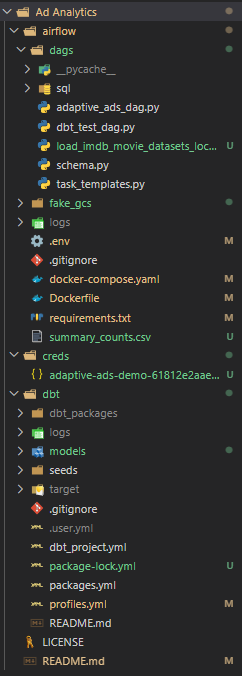

# Ad Analytics: End-to-End Data Engineering Pipeline

## Overview

**Ad Analytics** is a production-style data engineering project that demonstrates how real-world advertising or media platforms manage, transform, and analyze data.  
It simulates an end-to-end ELT (Extract, Load, Transform) workflow — from raw CSV ingestion to automated transformations and analytics using **Apache Airflow**, **dbt**, and **BigQuery**.

---

## Architecture


---

## Project Structure



---

## Data Flow (ELT)

### Ingestion

- Raw CSV files of IMDb movie data (one per genre) are stored in `dbt/seeds/imdb_movie_dataset/`.
- Airflow DAGs load these files into **BigQuery**.
- Conversion from **CSV → Parquet → BigQuery** ensures efficient querying.

### Load

- Airflow orchestrates the loading of transformed Parquet data into **BigQuery raw tables**.
- Datasets like `imdb_dataset.action`, `imdb_dataset.romance`, etc., are created.

### Transform

- dbt performs SQL-based transformations on BigQuery tables:
  - Cleans data (removes nulls, renames columns)
  - Aggregates and enriches metrics (ratings, votes, etc.)
  - Creates analytical models (e.g., `top_action_movies`)

### Orchestration

- Airflow automates the entire pipeline:
  - Executes ingestion and transformation DAGs on schedule.
  - Monitors task success and logs progress in the Airflow UI.

### Visualization

- Final tables are stored in BigQuery and can be connected to **Looker Studio**, **Tableau**, or other BI tools for insights.

---

## Tech Stack

| Layer                 | Tool                   | Purpose                                |
| --------------------- | ---------------------- | -------------------------------------- |
| **Orchestration**     | Apache Airflow         | Automates and monitors data workflows  |
| **Transformation**    | dbt                    | Cleans and models data inside BigQuery |
| **Storage/Warehouse** | Google BigQuery        | Stores raw and transformed datasets    |
| **Format**            | CSV, Parquet           | Efficient data exchange formats        |
| **Containerization**  | Docker, docker-compose | Local development setup                |
| **Language**          | Python, SQL            | Core scripting and modeling languages  |

---

## ⚙️ Setup Instructions

### 1. Install Prerequisites

Before you begin, ensure the following tools are installed and configured on your system:

- **Docker Desktop** (latest version)
- **Python 3.9+**
- **Google Cloud Project** with BigQuery enabled
- **Service Account Key** file placed under:  
  `airflow/creds/<your-service-account>.json`

---

### 2. Environment Configuration

#### Step 1: Add Service Account Credentials

Place your Google Cloud **service account key (JSON)** inside the `airflow/creds/` directory.  
This file is mounted into the Airflow container for authentication.

#### Step 2: Create the `.env` File

Inside the `airflow/` directory, create a new file named `.env` and add the following environment variables:

```bash
GCP_PROJECT_ID=<your-gcp-project-id>
BIGQUERY_DATASET=<your-bigquery-dataset-name>
GOOGLE_APPLICATION_CREDENTIALS=/opt/airflow/creds/<your-service-account>.json
```

### 3. Start the Airflow Environment

Navigate to the `airflow/` directory and start all Airflow services using Docker Compose:

```bash
cd airflow
docker-compose up -d
```

Once all containers are running, you can access the interfaces below:

- Airflow Webserver: http://localhost:8080
- Flower (Task Monitoring): http://localhost:5555

To verify that all containers are active and healthy, run:

```bash
docker ps
```

### 4. Trigger DAGs in Airflow

After the Airflow web interface loads, follow these steps:

1. Go to Airflow UI → DAGs tab

2. Unpause the following DAGs:

- `load_imdb_movie_datasets_local`
- `adaptive_ads_dag`
- `dbt_test_dag`

Click the Trigger DAG button (▶️) beside each one.

### DAG Descriptions

| **DAG Name**                     | **Purpose**                                                         |
| -------------------------------- | ------------------------------------------------------------------- |
| `load_imdb_movie_datasets_local` | Loads raw IMDb CSV data → converts to Parquet → uploads to BigQuery |
| `adaptive_ads_dag`               | Orchestrates the complete ad analytics data pipeline                |
| `dbt_test_dag`                   | Runs dbt transformations and data validation tests                  |

---

### Monitoring

You can track the execution flow through:

- **Airflow Graph View** → Visualizes task dependencies and order in which tasks execute
- **Flower Dashboard** → Monitors real-time task progress, retries, and worker status

### 5. Validate Results

Once the DAGs complete successfully:

- Check the fake_gcs/ folder in your project — it should contain Parquet files by movie genre.
- Verify data loaded into BigQuery under your configured dataset.
- Confirm dbt models (like top_action_movies) are created inside your analytics schema.

## 👩‍💻 Contributors:

* Ayesha
* Aarthi Honguthi
* Dhanalakshmi Dhanapal

---

## Demo Video:

Watch our 2-minute project demo here:
🔗 [https://drive.google.com/file/d/1eTF47OxUEebXEzhFnJKu9dfGXvvuQDAL/view?usp=sharing](https://drive.google.com/file/d/1eTF47OxUEebXEzhFnJKu9dfGXvvuQDAL/view?usp=sharing)

---
