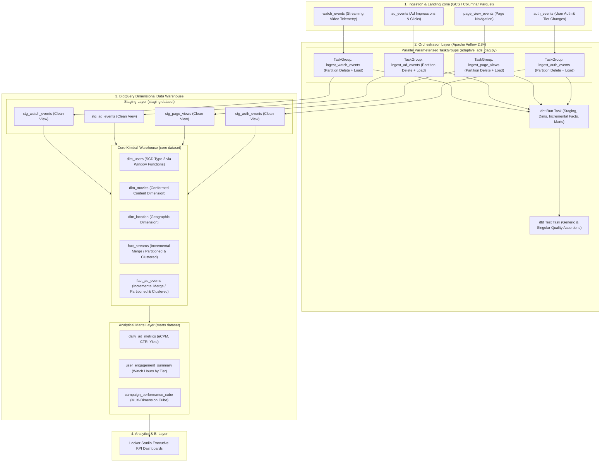

# Adaptive Ads: Enterprise Ad Analytics & Telemetry Data Engineering Platform

[](https://github.com/ayesha19765/ad-data/actions/workflows/ci.yml)
[](https://www.python.org/downloads/)
[](https://airflow.apache.org/)
[](https://www.getdbt.com/)
[](https://cloud.google.com/bigquery)
[](LICENSE)

**Adaptive Ads** is an enterprise data engineering platform designed to ingest, model, and analyze high-velocity advertising and video streaming telemetry on **Google Cloud Platform (GCP)**. 

Orchestrated with **Apache Airflow**, transformed using **dbt Core**, and stored in **Google BigQuery**, the platform processes raw telemetry event streams into an enterprise **Kimball dimensional star schema**, featuring **SCD Type 2** user dimensions, **incremental fact tables**, day-level **partitioning and clustering**, **late-arriving data lookbacks**, **declarative data contracts**, **7-gate CI/CD workflows**, and **Looker-ready analytical data marts**.

---

## 🏛️ System Architecture


```mermaid
flowchart TD
    subgraph Raw_Layer["1. Ingestion & Landing Zone (GCS / Columnar Parquet)"]
        W_SRC["watch_events (Streaming Video Telemetry)"]
        A_SRC["ad_events (Ad Impressions & Clicks)"]
        P_SRC["page_view_events (Page Navigation)"]
        AU_SRC["auth_events (User Auth & Tier Changes)"]
    end

    subgraph Airflow_Layer["2. Orchestration Layer (Apache Airflow 2.8+)"]
        subgraph TG_Ingestion["Parallel Parameterized TaskGroups (adaptive_ads_dag.py)"]
            T1["TaskGroup: ingest_watch_events (Partition Delete + Load)"]
            T2["TaskGroup: ingest_ad_events (Partition Delete + Load)"]
            T3["TaskGroup: ingest_page_views (Partition Delete + Load)"]
            T4["TaskGroup: ingest_auth_events (Partition Delete + Load)"]
        end
        DBT_RUN["dbt Run Task (Staging, Dims, Incremental Facts, Marts)"]
        DBT_TEST["dbt Test Task (Generic & Singular Quality Assertions)"]
    end

    subgraph BigQuery_DW["3. BigQuery Dimensional Data Warehouse"]
        subgraph Staging["Staging Layer (staging dataset)"]
            STG_W["stg_watch_events (Clean View)"]
            STG_A["stg_ad_events (Clean View)"]
            STG_P["stg_page_views (Clean View)"]
            STG_AU["stg_auth_events (Clean View)"]
        end

        subgraph Core["Core Kimball Warehouse (core dataset)"]
            DIM_U["dim_users (SCD Type 2 via Window Functions)"]
            DIM_M["dim_movies (Conformed Content Dimension)"]
            DIM_L["dim_location (Geographic Dimension)"]
            FACT_S["fact_streams (Incremental Merge / Partitioned & Clustered)"]
            FACT_A["fact_ad_events (Incremental Merge / Partitioned & Clustered)"]
        end

        subgraph Marts["Analytical Marts Layer (marts dataset)"]
            MART_AD["daily_ad_metrics (eCPM, CTR, Yield)"]
            MART_ENG["user_engagement_summary (Watch Hours by Tier)"]
            MART_CAMP["campaign_performance_cube (Multi-Dimension Cube)"]
        end
    end

    subgraph BI_Layer["4. Analytics & BI Layer"]
        LOOKER["Looker Studio Executive KPI Dashboards"]
    end

    W_SRC --> T1
    A_SRC --> T2
    P_SRC --> T3
    AU_SRC --> T4

    T1 --> STG_W
    T2 --> STG_A
    T3 --> STG_P
    T4 --> STG_AU

    T1 & T2 & T3 & T4 --> DBT_RUN --> DBT_TEST

    STG_W & STG_A & STG_P & STG_AU --> Core
    Core --> Marts
    Marts --> LOOKER
```

---

## 🎓 Interview Preparation & 30-Minute Revision Knowledge Base

This repository contains a self-contained interview preparation and project revision system. Whether preparing the night before or reviewing after 6 months, follow these structured pathways:

### ⏱️ Quick Navigation by Preparation Time
- **5-Minute Refresh**: Read [`docs/START_HERE.md`](docs/START_HERE.md) and [`docs/ONE_PAGE_CHEATSHEET.md`](docs/ONE_PAGE_CHEATSHEET.md).
- **15-Minute Narrative**: Read [`docs/PROJECT_STORY.md`](docs/PROJECT_STORY.md), [`docs/PITCH.md`](docs/PITCH.md), and [`docs/ARCHITECTURE_CHEATSHEET.md`](docs/ARCHITECTURE_CHEATSHEET.md).
- **30-Minute Master Review**: Follow [`docs/REVISION_30_MIN.md`](docs/REVISION_30_MIN.md) and quiz yourself with [`docs/INTERVIEW_RAPID_FIRE.md`](docs/INTERVIEW_RAPID_FIRE.md).
- **60-Minute Comprehensive Deep Dive**: Study [`docs/INTERVIEW_DEEP_DIVE.md`](docs/INTERVIEW_DEEP_DIVE.md), [`docs/MOCK_INTERVIEW.md`](docs/MOCK_INTERVIEW.md), and all Subsystem Revision Guides.

### 📚 Core Revision & Interview Documents

| Document | Purpose & Description | Focus Area |
| :--- | :--- | :--- |
| 🚀 **[docs/START_HERE.md](docs/START_HERE.md)** | Timed entry points (5m, 15m, 30m, 60m) for interview revision. | Quick Onboarding |
| 📄 **[docs/ONE_PAGE_CHEATSHEET.md](docs/ONE_PAGE_CHEATSHEET.md)** | Single-screen summary of metrics, files, trade-offs, and recovery commands. | Cheat Sheet |
| 📖 **[docs/PROJECT_STORY.md](docs/PROJECT_STORY.md)** | End-to-end technical narrative from business problem to warehouse analytics. | Story & Context |
| 🎤 **[docs/PITCH.md](docs/PITCH.md)** | 30s, 60s, 2m, 5m, and 10m elevator pitches and technical walkthroughs. | Communication |
| 🔄 **[docs/DATA_FLOW.md](docs/DATA_FLOW.md)** | Step-by-step telemetry progression & "Follow One Event" code walkthrough. | Data Flow |
| 🏛️ **[docs/ARCHITECTURE_CHEATSHEET.md](docs/ARCHITECTURE_CHEATSHEET.md)** | Quick component $\rightarrow$ technology $\rightarrow$ purpose $\rightarrow$ code file mapping matrix. | Architecture |
| ⚖️ **[docs/DECISION_CHEATSHEET.md](docs/DECISION_CHEATSHEET.md)** | Summary of key Architectural Decision Records (ADRs) and trade-offs. | Decisions |
| ❓ **[docs/WHY.md](docs/WHY.md)** | Direct evidence-based answers to 20+ architectural "Why" questions. | Defense |
| 🚫 **[docs/WHY_NOT.md](docs/WHY_NOT.md)** | Clear justification for why Kafka, Spark, Snowflake, etc., were omitted. | Alternatives |
| ⚡ **[docs/INTERVIEW_RAPID_FIRE.md](docs/INTERVIEW_RAPID_FIRE.md)** | **75+ categorized flashcards** with interactive collapsible answers. | Self-Testing |
| 🎯 **[docs/INTERVIEW_DEEP_DIVE.md](docs/INTERVIEW_DEEP_DIVE.md)** | **30+ in-depth questions & comprehensive answers** with real code references. | Technical Depth |
| 🪤 **[docs/INTERVIEW_TRAPS.md](docs/INTERVIEW_TRAPS.md)** | 5 tricky interview trap questions and how to answer them like a senior engineer. | Interview Traps |
| 🧱 **[docs/ANSWER_FRAMEWORKS.md](docs/ANSWER_FRAMEWORKS.md)** | Structuring templates (C-I-T-Q-C, S-D-R-P, R-A-C-T, B-M-E-R) for clear answers. | Frameworks |
| 🎭 **[docs/MOCK_INTERVIEW.md](docs/MOCK_INTERVIEW.md)** | 5-round simulated 30-minute mock interview script with scoring rubrics. | Mock Practice |
| 🧠 **[docs/TEACH_BACK.md](docs/TEACH_BACK.md)** | Active recall exercises and self-assessment prompts. | Active Recall |
| ⏱️ **[docs/REVISION_30_MIN.md](docs/REVISION_30_MIN.md)** | Minute-by-minute 30-minute revision checklist with interactive checkboxes. | Final Prep |
| 📋 **[docs/INTERVIEW_DAY_CHECKLIST.md](docs/INTERVIEW_DAY_CHECKLIST.md)** | 15m/10m/5m interview countdown guide and whiteboard architecture layout. | Day of Interview |
| 📅 **[docs/PROJECT_TIMELINE.md](docs/PROJECT_TIMELINE.md)** | Chronological history of engineering phases from Phase 1 to Phase 8. | Evolution |
| 🛠️ **[docs/WHAT_I_BUILT.md](docs/WHAT_I_BUILT.md)** | Complete feature-to-exact-code-file mapping table. | Code Mapping |
| 💡 **[docs/PROBLEMS_SOLVED.md](docs/PROBLEMS_SOLVED.md)** | Real problems diagnosed and resolved (retries, scans, SCD2, drift). | Problem Solving |

### 🔍 Focused Subsystem Revision Guides

- 🌀 **[docs/REVISION_AIRFLOW.md](docs/REVISION_AIRFLOW.md)**: DAG design, `EVENT_CONFIG` registry, dynamic TaskGroups, retries, and timeouts.
- 🧱 **[docs/REVISION_DBT.md](docs/REVISION_DBT.md)**: Staging views, dimensional tables, incremental merges, and schema test graphs.
- 📐 **[docs/REVISION_DATA_MODELING.md](docs/REVISION_DATA_MODELING.md)**: Star Schema, dimensional grains, MD5 surrogate keys, and analytical marts.
- 👥 **[docs/REVISION_SCD2.md](docs/REVISION_SCD2.md)**: SCD Type 2 deep dive with SQL window functions (`LAG`, `SUM`, `LEAD`) and invariants.
- 🔁 **[docs/REVISION_IDEMPOTENCY.md](docs/REVISION_IDEMPOTENCY.md)**: Partition-scoped delete+insert and operational backfills (`scripts/backfill.py`).
- 🛡️ **[docs/REVISION_DATA_QUALITY.md](docs/REVISION_DATA_QUALITY.md)**: 4-tier quality testing pyramid and declarative YAML contracts.
- 🚨 **[docs/REVISION_FAILURES.md](docs/REVISION_FAILURES.md)**: 7 production failure scenarios, root causes, and recovery procedures.
- ⚡ **[docs/REVISION_SCALABILITY.md](docs/REVISION_SCALABILITY.md)**: Scaling trajectory across 1x, 10x, 100x, and 1,000x streaming roadmap.
- 💰 **[docs/REVISION_BIGQUERY.md](docs/REVISION_BIGQUERY.md)**: Day partitioning, multi-column clustering, projection pruning, and cost control.
- 🔄 **[docs/REVISION_CICD.md](docs/REVISION_CICD.md)**: 7 automated GitHub Actions quality gates and pre-commit checks.
- 🔒 **[docs/REVISION_SECURITY.md](docs/REVISION_SECURITY.md)**: Data classification, PII isolation in `dim_users`, and IAM least-privilege matrix.
- 📊 **[docs/REVISION_OBSERVABILITY.md](docs/REVISION_OBSERVABILITY.md)**: Alert severity routing, SLO error budgets, and operations runbook.
- 💾 **[docs/REVISION_DISASTER_RECOVERY.md](docs/REVISION_DISASTER_RECOVERY.md)**: RPO/RTO objectives, BigQuery Time Travel, and recovery playbooks.

---

## ⚡ Key Engineering Capabilities

1. **Decoupled Parallel Ingestion**: Reusable Airflow `TaskGroup` architecture driven by a centralized `EVENT_CONFIG` registry, allowing new event streams to be onboarded via configuration without pipeline code duplication.
2. **Partition-Scoped Idempotency**: Atomic `DELETE` + `INSERT` pattern on execution timestamp windows guarantees exact-once staging state on retries and backfills without duplicate records.
3. **Kimball Dimensional Modeling**:
   - **SCD Type 2 User Dimension (`dim_users`)**: Window-function logic tracking historical subscriber membership transitions (`Free` vs `Paid`) with non-overlapping validity ranges.
   - **Incremental Fact Loading (`fact_streams`, `fact_ad_events`)**: BigQuery `merge` strategy with Day-level partitioning, multi-column clustering, and a 3-day lookback window for late-arriving telemetry.
4. **Warehouse Performance & Cost Control**:
   - `incremental_predicates` restricts incremental `MERGE` partition scans to the last 3 days, saving up to 90% in query scan bytes.
   - Multi-column clustering (`campaignId`, `adPlacement`, `userId`, `movieId`) prunes unneeded storage blocks.
   - Controlled column projections eliminate wildcard `SELECT *` across all core models.
5. **Declarative Data Contracts & Testing Pyramid**:
   - Contracts in `contracts/*.yml` enforced via automated CI gates (`scripts/validate_contracts.py`).
   - 4-tier testing pyramid: 19 fast unit tests (0.02s) + dbt generic schema tests + singular SQL business assertions + full repository validator.
6. **Operational Tooling**:
   - `scripts/backfill.py`: Safe CLI backfill orchestrator with ISO-8601 validation, partition isolation, and dry-run previews.
   - `scripts/check_schema.py`: Automated schema drift detector reporting added, removed, or type-shifted fields.
7. **Disaster Recovery & Durability**:
   - RPO $\le$ 1 hour, RTO $\le$ 30 minutes, instantaneous restoration via BigQuery 7-day Time Travel snapshots.

---

## 🛠️ Tech Stack Matrix

| Layer | Technology | Version | Purpose |
| :--- | :--- | :--- | :--- |
| **Orchestration** | Apache Airflow | 2.8.1+ | Hourly batch scheduling, parallel TaskGroups, retry management |
| **Transformations** | dbt-core / dbt-bigquery | 1.6.0+ | Staging views, SCD2 dimensions, incremental facts, marts |
| **Data Warehouse** | Google BigQuery | Standard SQL | MPP serverless analytics, day partitioning, multi-column clustering |
| **Raw Storage** | Google Cloud Storage | Standard / Multi-Region | Ingestion landing zone for columnar Snappy Parquet telemetry files |
| **CI / CD** | GitHub Actions | v4 / v5 | Automated multi-stage PR and push quality validation (7 quality gates) |
| **Linters & QA** | Ruff / SQLFluff | Latest | Python code quality and BigQuery SQL dialect formatting |
| **Unit Testing** | Python Unittest | Standard Library | 19 automated unit tests verifying configs, backfills, and contracts |
| **Containerization** | Docker / Compose | Compose v2 | Local development cluster (Celery, Redis, Postgres) |

---

## 📐 Data Warehouse Model Inventory

| Layer | Model Name | Materialization | Grain | Description |
| :--- | :--- | :--- | :--- | :--- |
| **Staging** | `stg_watch_events` | View | 1 row / watch event | Standardized video stream playback telemetry. |
| **Staging** | `stg_ad_events` | View | 1 row / ad event | Standardized ad impression and interaction telemetry. |
| **Staging** | `stg_page_views` | View | 1 row / page view | Standardized web/mobile page navigation telemetry. |
| **Staging** | `stg_auth_events` | View | 1 row / auth event | Standardized user session & subscription tier change events. |
| **Core** | `dim_users` | Table (SCD2) | 1 row / user / tier period | Historical tier tracking with non-overlapping validity intervals. |
| **Core** | `dim_movies` | Table | 1 row / content item | Enriched video content dimension. |
| **Core** | `dim_location` | Table | 1 row / geo coordinate | Geographic dimension with country and city lookups. |
| **Core** | `fact_streams` | Incremental (Merge) | 1 row / streaming event | Day-partitioned and clustered stream playback facts. |
| **Core** | `fact_ad_events` | Incremental (Merge) | 1 row / ad event | Day-partitioned and clustered ad interaction facts. |
| **Marts** | `daily_ad_metrics` | Table | 1 row / day / campaign / tier | Daily ad performance mart with safe derived rates (eCPM, CTR). |
| **Marts** | `user_engagement_summary` | Table | 1 row / day / tier | Daily audience streaming engagement and watch duration metrics. |
| **Marts** | `campaign_performance_cube` | Table | 1 row / campaign / placement | Multi-dimensional ad yield cube for executive reporting. |

---

## 🚀 Getting Started & Local Validation

### 1. Prerequisites
- Docker & Docker Desktop (v20+)
- Python 3.9+
- Google Cloud Project with BigQuery enabled (for live cloud execution)

### 2. Environment Configuration
```bash
# Create local environment configuration
cp airflow/.env.example airflow/.env
```

Configure the environment variables in `airflow/.env`:
```bash
GCP_PROJECT_ID=adaptive-ads-telemetry
BIGQUERY_DATASET=adaptive_ads_stg
GCP_GCS_BUCKET=adaptive-ads-telemetry-raw
GOOGLE_APPLICATION_CREDENTIALS=/opt/airflow/creds/service-account.json
```

### 3. Run the Automated Local Validation Suite
Run the 9-step local quality validation suite:
```bash
./scripts/validate.sh
```

**Checks Executed (9/9 Automated Checks)**:
1. Python syntax & compilation (`python3 -m py_compile`)
2. Python unit test suite execution (19 tests in `tests/unit/`)
3. Airflow DAG definition, task IDs, and template mapping verification
4. SQL file integrity and syntax scanning across all dbt and Airflow models
5. dbt schema YAML graph and test definition parsing
6. Security and secret leak scanning
7. Performance & partition pruning safeguards (`incremental_predicates` & explicit projections)
8. Operational tooling smoke tests (`check_schema.py`, `backfill.py --dry-run`, `validate_contracts.py`)
9. Markdown documentation link and integrity validation (`validate_docs.py`)

---

## 📚 Complete Technical Documentation Index

### 🚀 Architecture & Core Specifications
- 📖 **[docs/ARCHITECTURE.md](docs/ARCHITECTURE.md)**: Canonical end-to-end architecture specification.
- 🏛️ **[docs/ARCHITECTURE_CHEATSHEET.md](docs/ARCHITECTURE_CHEATSHEET.md)**: Component to tech to code mapping cheat sheet.
- 🔄 **[docs/DATA_FLOW.md](docs/DATA_FLOW.md)**: End-to-end data flow and step-by-step event trace.
- 📜 **[docs/DATA_CONTRACTS.md](docs/DATA_CONTRACTS.md)**: Declarative data contracts and interface rules.
- 📐 **[docs/MODEL_MATERIALIZATION.md](docs/MODEL_MATERIALIZATION.md)**: Materialization breakdown for all 17 models.
- 🏛️ **[docs/DECISIONS.md](docs/DECISIONS.md)**: Architectural Decision Records (ADR-001 through ADR-014).
- ⚖️ **[docs/DECISION_CHEATSHEET.md](docs/DECISION_CHEATSHEET.md)**: Decision matrix, alternatives, and trade-offs.

### 🎓 Interview Preparation & Revision System
- 🚀 **[docs/START_HERE.md](docs/START_HERE.md)**: Timed 5m, 15m, 30m, 60m revision pathways.
- 📄 **[docs/ONE_PAGE_CHEATSHEET.md](docs/ONE_PAGE_CHEATSHEET.md)**: Single-screen ultimate cheat sheet.
- 📖 **[docs/PROJECT_STORY.md](docs/PROJECT_STORY.md)**: Narrative story of the project from problem to BI.
- 🎤 **[docs/PITCH.md](docs/PITCH.md)**: Elevator pitches (30s, 60s, 2m, 5m, 10m).
- ⚡ **[docs/INTERVIEW_RAPID_FIRE.md](docs/INTERVIEW_RAPID_FIRE.md)**: 75+ categorized flashcard Q&As.
- 🎯 **[docs/INTERVIEW_DEEP_DIVE.md](docs/INTERVIEW_DEEP_DIVE.md)**: 30+ deep-dive technical questions & answers.
- 🪤 **[docs/INTERVIEW_TRAPS.md](docs/INTERVIEW_TRAPS.md)**: 5 interview trap questions and senior defenses.
- 🧱 **[docs/ANSWER_FRAMEWORKS.md](docs/ANSWER_FRAMEWORKS.md)**: Communication templates (C-I-T-Q-C, S-D-R-P, etc.).
- 🎭 **[docs/MOCK_INTERVIEW.md](docs/MOCK_INTERVIEW.md)**: 5-round simulated mock interview script and rubrics.
- 🧠 **[docs/TEACH_BACK.md](docs/TEACH_BACK.md)**: Active recall exercises and prompts.
- ⏱️ **[docs/REVISION_30_MIN.md](docs/REVISION_30_MIN.md)**: 30-minute pre-interview revision checklist.
- 📋 **[docs/INTERVIEW_DAY_CHECKLIST.md](docs/INTERVIEW_DAY_CHECKLIST.md)**: Final countdown guide and whiteboard diagram.
- 🎓 **[docs/INTERVIEW_HANDBOOK.md](docs/INTERVIEW_HANDBOOK.md)**: Original technical interview handbook (48+ Q&As).
- ❓ **[docs/WHY.md](docs/WHY.md)**: Answers to 20+ "Why" architectural questions.
- 🚫 **[docs/WHY_NOT.md](docs/WHY_NOT.md)**: Detailed answers to "Why Not Kafka/Spark/Snowflake?".
- 🛠️ **[docs/WHAT_I_BUILT.md](docs/WHAT_I_BUILT.md)**: Code-to-feature mapping table.
- 💡 **[docs/PROBLEMS_SOLVED.md](docs/PROBLEMS_SOLVED.md)**: Real engineering problems diagnosed and resolved.
- 📅 **[docs/PROJECT_TIMELINE.md](docs/PROJECT_TIMELINE.md)**: Chronological phase history.

### 🔍 Subsystem Revision Guides
- 🌀 **[docs/REVISION_AIRFLOW.md](docs/REVISION_AIRFLOW.md)**: Airflow orchestration revision guide.
- 🧱 **[docs/REVISION_DBT.md](docs/REVISION_DBT.md)**: dbt transformation revision guide.
- 📐 **[docs/REVISION_DATA_MODELING.md](docs/REVISION_DATA_MODELING.md)**: Dimensional modeling revision guide.
- 👥 **[docs/REVISION_SCD2.md](docs/REVISION_SCD2.md)**: SCD Type 2 revision guide.
- 🔁 **[docs/REVISION_IDEMPOTENCY.md](docs/REVISION_IDEMPOTENCY.md)**: Ingestion idempotency & backfills.
- 🛡️ **[docs/REVISION_DATA_QUALITY.md](docs/REVISION_DATA_QUALITY.md)**: Data quality and testing hierarchy.
- 🚨 **[docs/REVISION_FAILURES.md](docs/REVISION_FAILURES.md)**: Failure modes and recovery matrix.
- ⚡ **[docs/REVISION_SCALABILITY.md](docs/REVISION_SCALABILITY.md)**: Scalability and growth trajectory.
- 💰 **[docs/REVISION_BIGQUERY.md](docs/REVISION_BIGQUERY.md)**: BigQuery cost optimization & performance.
- 🔄 **[docs/REVISION_CICD.md](docs/REVISION_CICD.md)**: CI/CD quality gates revision guide.
- 🔒 **[docs/REVISION_SECURITY.md](docs/REVISION_SECURITY.md)**: Data security and governance.
- 📊 **[docs/REVISION_OBSERVABILITY.md](docs/REVISION_OBSERVABILITY.md)**: Observability, alerts, and SLOs.
- 💾 **[docs/REVISION_DISASTER_RECOVERY.md](docs/REVISION_DISASTER_RECOVERY.md)**: Disaster recovery revision guide.

### ⚙️ Performance, Reliability & Operations
- 💰 **[docs/BIGQUERY_COST_OPTIMIZATION.md](docs/BIGQUERY_COST_OPTIMIZATION.md)**: BigQuery partition pruning and clustering.
- ⏱️ **[docs/LATE_ARRIVING_DATA.md](docs/LATE_ARRIVING_DATA.md)**: 3-day sliding lookback strategy.
- 📑 **[docs/DUPLICATE_HANDLING.md](docs/DUPLICATE_HANDLING.md)**: Pipeline duplicates vs. source deduplication.
- 🔄 **[docs/SCHEMA_EVOLUTION.md](docs/SCHEMA_EVOLUTION.md)**: Schema change management rules.
- 📊 **[docs/PERFORMANCE_TESTING.md](docs/PERFORMANCE_TESTING.md)**: Stress testing and benchmarking.
- ⚡ **[docs/SCALABILITY.md](docs/SCALABILITY.md)**: Scaling strategy across 1x, 10x, 100x, 1,000x.
- 💵 **[docs/COST_MODEL.md](docs/COST_MODEL.md)**: Cloud infrastructure cost model.
- ⏱️ **[docs/DATA_FRESHNESS.md](docs/DATA_FRESHNESS.md)**: Freshness SLAs across layers.
- 🛠️ **[docs/OPERATIONS_RUNBOOK.md](docs/OPERATIONS_RUNBOOK.md)**: Triage procedures and runbooks.
- 🚨 **[docs/DISASTER_RECOVERY.md](docs/DISASTER_RECOVERY.md)**: 7 DR playbooks and Time Travel recovery.
- 🚨 **[docs/ALERTING.md](docs/ALERTING.md)**: Incident severity routing matrix.
- 🎯 **[docs/SLO.md](docs/SLO.md)**: Service Level Objectives & error budgets.
- 🔒 **[docs/DATA_GOVERNANCE.md](docs/DATA_GOVERNANCE.md)**: Data classification and PII isolation.
- 👥 **[docs/OWNERSHIP.md](docs/OWNERSHIP.md)**: Platform ownership and RACI matrix.
- 🔄 **[docs/RELEASE_PROCESS.md](docs/RELEASE_PROCESS.md)**: Trunk-based release and rollback.
- 📦 **[docs/REPRODUCIBILITY.md](docs/REPRODUCIBILITY.md)**: Environment reproducibility specification.
- 🚢 **[docs/DEPLOYMENT.md](docs/DEPLOYMENT.md)**: Cloud Composer & BigQuery deployment guide.
- 🔄 **[docs/CI_CD.md](docs/CI_CD.md)**: GitHub Actions CI/CD specification.
- 📊 **[docs/BI_DASHBOARD.md](docs/BI_DASHBOARD.md)**: Looker Studio dashboard specification.
- 📑 **[docs/TECHNICAL_DEBT.md](docs/TECHNICAL_DEBT.md)**: Technical debt register.
- 🏆 **[docs/PROJECT_SCORECARD.md](docs/PROJECT_SCORECARD.md)**: 14-dimension maturity scorecard (9.5/10).
- 💼 **[docs/PORTFOLIO_AUDIT.md](docs/PORTFOLIO_AUDIT.md)**: Hiring manager technical audit.
- 📑 **[docs/PHASE_1_AUDIT.md](docs/PHASE_1_AUDIT.md)**: Phase 1 baseline audit.
- 📑 **[docs/PHASE_2_ARCHITECTURE.md](docs/PHASE_2_ARCHITECTURE.md)**: Phase 2 architecture report.
- 📑 **[docs/PHASE_3_WAREHOUSE.md](docs/PHASE_3_WAREHOUSE.md)**: Phase 3 warehouse design report.
- 📑 **[docs/PHASE_4_PRODUCTION.md](docs/PHASE_4_PRODUCTION.md)**: Phase 4 production hardening report.
- 📑 **[docs/PHASE_6_PERFORMANCE.md](docs/PHASE_6_PERFORMANCE.md)**: Phase 6 performance audit.
- 📑 **[docs/PHASE_7_AUDIT.md](docs/PHASE_7_AUDIT.md)**: Phase 7 governance audit.
- 📑 **[docs/PHASE_8_AUDIT.md](docs/PHASE_8_AUDIT.md)**: Phase 8 revision & interview audit.

---

## 👥 Contributors

- **Ayesha**
- **Aarthi Honguthi**
- **Dhanalakshmi Dhanapal**
