# Ad Data: End-to-End Data Engineering Pipeline
# Adaptive Ads: Enterprise Ad Analytics & Telemetry Data Engineering Platform

## Overview
[](https://github.com/ayesha19765/ad-data/actions/workflows/ci.yml)
[](https://www.python.org/downloads/release/python-390/)
[](https://airflow.apache.org/)
[](https://www.getdbt.com/)
[](https://cloud.google.com/bigquery)

**Ad Analytics** is a production-style data engineering project that demonstrates how real-world advertising or media platforms manage, transform, and analyze data.  
It simulates an end-to-end ELT (Extract, Load, Transform) workflow — from raw CSV ingestion to automated transformations and analytics using **Apache Airflow**, **dbt**, and **BigQuery**.
**Adaptive Ads** is an end-to-end Data Engineering platform built to ingest, model, and analyze high-velocity advertising and video streaming telemetry on **Google Cloud Platform (GCP)**. 
**Adaptive Ads** is an enterprise data engineering platform designed to ingest, model, and analyze high-velocity advertising and video streaming telemetry on **Google Cloud Platform (GCP)**. 

---
Orchestrated with **Apache Airflow**, transformed using **dbt**, and queried on **Google BigQuery**, the platform processes raw telemetry event streams into an enterprise **Kimball dimensional star schema**, featuring **SCD Type 2** user dimensions, **incremental fact tables**, day-level **partitioning/clustering**, and **Looker-ready analytical marts**.
Orchestrated with **Apache Airflow**, transformed using **dbt**, and queried on **Google BigQuery**, the platform processes raw telemetry event streams into an enterprise **Kimball dimensional star schema**, featuring **SCD Type 2** user dimensions, **incremental fact tables**, day-level **partitioning/clustering**, **late-arriving data lookbacks**, and **Looker-ready analytical marts**.
Orchestrated with **Apache Airflow**, transformed using **dbt**, and queried on **Google BigQuery**, the platform processes raw telemetry event streams into an enterprise **Kimball dimensional star schema**, featuring **SCD Type 2** user dimensions, **incremental fact tables**, day-level **partitioning/clustering**, **late-arriving data lookbacks**, **declarative data contracts**, and **Looker-ready analytical marts**.

## Architecture

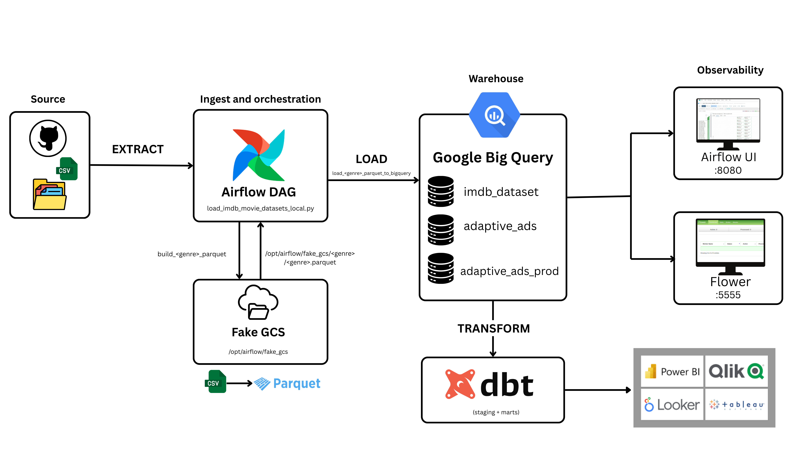

---

## Project Structure
## 🏛️ System Architecture

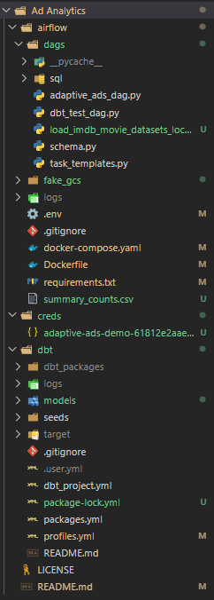
```mermaid
flowchart TD
    subgraph Raw_Layer["1. Ingestion & Landing Zone (GCS / Parquet)"]
        W_SRC["watch_events (Streaming Telemetry)"]
        A_SRC["ad_events (Ad Impressions & Clicks)"]
        P_SRC["page_view_events (Page Navigation)"]
        AU_SRC["auth_events (User Sessions)"]
    end

---
    subgraph Airflow_Layer["2. Orchestration Layer (Apache Airflow)"]
        subgraph TG_Ingestion["Parallel TaskGroups (adaptive_ads_dag)"]
            T1["TaskGroup: ingest_watch_events"]
            T2["TaskGroup: ingest_ad_events"]
            T3["TaskGroup: ingest_page_view_events"]
            T4["TaskGroup: ingest_auth_events"]
        end
        DBT_SEED["dbt Seed Task (state_codes)"]
        DBT_RUN["dbt Run Task (Incremental Builds)"]
        DBT_TEST["dbt Test Task (Data Quality Gates)"]
    end

## Data Flow (ELT)
    subgraph BigQuery_DW["3. BigQuery Dimensional Data Warehouse"]
        subgraph Staging["Staging Views (adaptive_ads_stg)"]
            STG_W["stg_watch_events"]
            STG_A["stg_ad_events"]
            STG_M["stg_movies"]
            STG_SC["stg_state_codes"]
        end

### Ingestion
        subgraph Core["Core Kimball Warehouse (adaptive_ads_prod)"]
            DIM_U["dim_users (SCD Type 2)"]
            DIM_M["dim_movies"]
            DIM_L["dim_location"]
            DIM_D["dim_datetime"]
            FACT_S["fact_streams (Incremental / Partitioned)"]
            FACT_A["fact_ad_events (Incremental / Partitioned)"]
        end

- Raw CSV files of IMDb movie data (one per genre) are stored in `dbt/seeds/imdb_movie_dataset/`.
- Airflow DAGs load these files into **BigQuery**.
- Conversion from **CSV → Parquet → BigQuery** ensures efficient querying.
        subgraph Marts["Analytical Marts & BI Reporting"]
            MART_AD["daily_ad_metrics"]
            MART_CONTENT["ad_content_performance"]
            MART_ENG["daily_user_engagement"]
            MART_WIDE["wide_streams (Reporting View)"]
        end
    end

### Load
    subgraph BI_Layer["4. Analytics & BI Layer"]
        LOOKER["Looker Studio Executive Dashboard"]
    end

- Airflow orchestrates the loading of transformed Parquet data into **BigQuery raw tables**.
- Datasets like `imdb_dataset.action`, `imdb_dataset.romance`, etc., are created.
    W_SRC --> T1
    A_SRC --> T2
    P_SRC --> T3
    AU_SRC --> T4

### Transform
    T1 & T2 & T3 & T4 --> DBT_SEED --> DBT_RUN --> DBT_TEST

- dbt performs SQL-based transformations on BigQuery tables:
  - Cleans data (removes nulls, renames columns)
  - Aggregates and enriches metrics (ratings, votes, etc.)
  - Creates analytical models (e.g., `top_action_movies`)
    T1 --> STG_W
    T2 --> STG_A
    STG_W & STG_A & STG_M & STG_SC --> Core
    Core --> Marts
    Marts --> LOOKER
```

### Orchestration
---

- Airflow automates the entire pipeline:
  - Executes ingestion and transformation DAGs on schedule.
  - Monitors task success and logs progress in the Airflow UI.
## ⚡ Key Engineering Capabilities
## ⚡ Scalability, Performance & Reliability Engineering

### Visualization
- **Decoupled Parallel Ingestion**: Reusable Airflow `TaskGroup` architecture driven by a centralized `EVENT_CONFIG` registry, allowing new event streams to be added via configuration without pipeline duplication.
- **Decoupled Parallel Ingestion**: Reusable Airflow `TaskGroup` architecture driven by a centralized `EVENT_CONFIG` registry, allowing new event streams to be onboarded via configuration without pipeline duplication.
- **Partition-Scoped Idempotency**: Atomic `DELETE` + `INSERT` pattern on execution timestamp windows guarantees exact-once semantics on retries and backfills without duplicate data.
- **Kimball Dimensional Modeling**:
  - **SCD Type 2 User Dimension (`dim_users`)**: Window-function logic tracking historical subscriber membership transitions (`free` vs `paid`) with non-overlapping validity ranges.
  - **Incremental Fact Loading (`fact_streams`, `fact_ad_events`)**: BigQuery `merge` strategy with Day-level partitioning, multi-column clustering, and a 3-day lookback window for late-arriving telemetry.
- **Business-Facing Analytical Marts**:
  - `daily_ad_metrics`: Daily impression volume, ad exposure duration, unique viewers, and safe rate derivations.
  - `ad_content_performance`: Content-level ad format exposures across video titles and genres.
  - `daily_user_engagement`: Audience streaming duration and volume segmented by membership tier.
  - `wide_streams`: Denormalized reporting view for BI slicing.
- **Two-Tier CI/CD & Automated Quality Gates**: Multi-stage GitHub Actions CI executing Python compilation, Ruff linting, SQLFluff BigQuery linting, `DagBag` parsing, dbt graph validation, and secret leak scanning.
- **Single-Command Local Validation**: Developer validation script (`./scripts/validate.sh`) running all static checks in seconds.
- **BigQuery Day Partitioning & Multi-Column Clustering**:
  - `fact_streams` and `fact_ad_events` are partitioned by `DAY` on `ts` and clustered on high-cardinality slice keys (`userKey`, `adType`, `videoKey`, `locationKey`), ensuring query scans prune irrelevant storage blocks.
- **Incremental Merges & Partition Pruning Bounds**:
  - Fact models utilize `dbt` incremental `merge` strategies with explicit `incremental_predicates` (`INTERVAL 7 DAY`), eliminating full-table scans during hourly upsert cycles.
- **Late-Arriving Telemetry Handling**:
  - Implements a **3-day sliding lookback window** (`ts >= MAX(ts) - INTERVAL 3 DAY`) that reconciles delayed mobile and web events without data loss or duplicate rows.
- **Partition-Scoped Idempotent Ingestion**:
  - Airflow tasks execute atomic `DELETE` + `INSERT` operations scoped strictly to the execution hour interval, guaranteeing exact-once staging state during retries and backfills.
- **Controlled Column Projection**:
  - Eliminates unbounded `SELECT *` across all core warehouse models and marts, reducing BigQuery memory footprint and slot-ms usage.
- **Declarative Data Contracts**: YAML contracts in `contracts/` enforced via automated CI gates (`scripts/validate_contracts.py`).
- **BigQuery Cost & Partition Pruning**:
  - `incremental_predicates` limits merge scans to the active 7-day window.
  - Multi-column clustering (`userKey`, `adType`, `videoKey`) prevents block scans.
  - Explicit column projections eliminate wildcard `SELECT *` across all core models.
- **Operational Backfill & Schema Drift Tooling**:
  - `scripts/backfill.py`: Safe CLI backfill orchestrator with date validation, partition isolation, and dry-run previews.
  - `scripts/check_schema.py`: Automated schema drift detector reporting added, removed, or type-shifted fields.
- **Disaster Recovery & Durability**:
  - RPO ≤ 1 hour, RTO ≤ 30 minutes, BigQuery 7-day Time Travel recovery playbooks.

- Final tables are stored in BigQuery and can be connected to **Looker Studio**, **Tableau**, or other BI tools for insights.

---

## Tech Stack
## 🛠️ Tech Stack Matrix

| Layer                 | Tool                   | Purpose                                |
| --------------------- | ---------------------- | -------------------------------------- |
| **Orchestration**     | Apache Airflow         | Automates and monitors data workflows  |
| **Transformation**    | dbt                    | Cleans and models data inside BigQuery |
| **Storage/Warehouse** | Google BigQuery        | Stores raw and transformed datasets    |
| **Format**            | CSV, Parquet           | Efficient data exchange formats        |
| **Containerization**  | Docker, docker-compose | Local development setup                |
| **Language**          | Python, SQL            | Core scripting and modeling languages  |
| Layer | Technology | Version | Purpose |
| :--- | :--- | :--- | :--- |
| **Orchestration** | Apache Airflow | 2.8.1 | Hourly batch scheduling, parallel TaskGroups, retry management |
| **Transformations** | dbt-core / dbt-bigquery | 1.6.0 | Staging views, SCD2 dimensions, incremental facts, marts |
| **Data Warehouse** | Google BigQuery | Standard SQL | MPP serverless analytics, day partitioning, clustering |
| **Raw Storage** | Google Cloud Storage | Standard | Ingestion landing zone for columnar Parquet telemetry files |
| **CI / CD** | GitHub Actions | v4 / v5 | Automated multi-stage PR and push quality validation |
| **Linters & QA** | Ruff / SQLFluff | Latest | Python 3.9 code quality and BigQuery SQL dialect formatting |
| **Testing** | Unittest / Pytest | Latest | Automated testing pyramid across configs, dates, and contracts |
| **Containerization** | Docker / Compose | Compose v2 | Local Airflow development cluster (Celery, Redis, Postgres) |

---

## ⚙️ Setup Instructions
## 📐 Data Warehouse Model Inventory

### 1. Install Prerequisites
| Layer | Model Name | Materialization | Grain | Description |
| :--- | :--- | :--- | :--- | :--- |
| **Staging** | `stg_watch_events` | View | 1 row / watch event | Standardized video stream playback telemetry. |
| **Staging** | `stg_ad_events` | View | 1 row / ad event | Standardized ad impression and interaction telemetry. |
| **Staging** | `stg_movies` | View | 1 row / content item | Standardized content catalog metadata. |
| **Staging** | `stg_state_codes` | View | 1 row / US state | Standardized US state code lookup reference. |
| **Core** | `dim_users` | Table (SCD2) | 1 row / user / tier period | Historical tier tracking with zero-gap intervals. |
| **Core** | `dim_movies` | Table | 1 row / content item | Enriched video content dimension. |
| **Core** | `dim_location` | Table | 1 row / geographic coordinate | Geographic dimension with state lookup. |
| **Core** | `dim_datetime` | Table | 1 row / calendar hour | Hourly time dimension with calendar attributes. |
| **Core** | `fact_streams` | Incremental (Merge) | 1 row / streaming event | Day-partitioned and clustered stream facts. |
| **Core** | `fact_ad_events` | Incremental (Merge) | 1 row / ad event | Day-partitioned and clustered ad interaction facts. |
| **Marts** | `daily_ad_metrics` | Table | 1 row / day / adType / video | Daily ad performance mart with safe derived rates. |
| **Marts** | `ad_content_performance` | Table | 1 row / video / adType | Content-level ad format performance mart. |
| **Marts** | `daily_user_engagement` | Table | 1 row / day / tier | Daily audience streaming engagement metrics. |
| **Marts** | `wide_streams` | View | 1 row / streaming event | Denormalized wide analytical reporting view. |

Before you begin, ensure the following tools are installed and configured on your system:
---

- **Docker Desktop** (latest version)
- **Python 3.9+**
- **Google Cloud Project** with BigQuery enabled
- **Service Account Key** file placed under:  
  `airflow/creds/<your-service-account>.json`
## 🚀 Getting Started

---
### 1. Prerequisites
- Docker & Docker Desktop (v20+)
- Python 3.9+
- Google Cloud Project with BigQuery enabled (for live execution)
- Google Cloud Project with BigQuery enabled (for live cloud execution)

### 2. Environment Configuration
Create your local environment file from the provided template:
```bash
cp airflow/.env.example airflow/.env
```

#### Step 1: Add Service Account Credentials

Place your Google Cloud **service account key (JSON)** inside the `airflow/creds/` directory.  
This file is mounted into the Airflow container for authentication.

#### Step 2: Create the `.env` File

Inside the `airflow/` directory, create a new file named `.env` and add the following environment variables:

Configure the environment variables in `airflow/.env`:
```bash
GCP_PROJECT_ID=<your-gcp-project-id>
BIGQUERY_DATASET=<your-bigquery-dataset-name>
GOOGLE_APPLICATION_CREDENTIALS=/opt/airflow/creds/<your-service-account>.json
GCP_PROJECT_ID=your-gcp-project-id
BIGQUERY_DATASET=adaptive_ads_stg
GCP_GCS_BUCKET=your-telemetry-bucket
GOOGLE_APPLICATION_CREDENTIALS=/opt/airflow/creds/service-account.json
```

### 3. Start the Airflow Environment

Navigate to the `airflow/` directory and start all Airflow services using Docker Compose:

### 3. Start Airflow Environment
```bash
cd airflow
docker-compose up -d
```
- **Airflow Webserver**: [http://localhost:8080](http://localhost:8080) (Default login: `airflow` / `airflow`)
- **Flower Dashboard**: [http://localhost:5555](http://localhost:5555)

Once all containers are running, you can access the interfaces below:
---

- Airflow Webserver: http://localhost:8080
- Flower (Task Monitoring): http://localhost:5555
## 🧪 Developer Validation Suite

To verify that all containers are active and healthy, run:

Run the full local validation suite with a single command:
```bash
docker ps
./scripts/validate.sh
```

### 4. Trigger DAGs in Airflow
**Checks Executed**:
**Automated Validation Suite (7/7 Checks)**:
**Automated Validation Suite (8/8 Checks)**:
1. Python syntax & compilation (`python3 -m py_compile`)
2. Airflow DAG definition, task IDs, and template mapping verification
3. SQL file integrity and syntax scanning across all dbt and Airflow models
4. dbt schema YAML graph and test definition validation
5. Security and secret leak detection
3. SQL file integrity and non-emptiness across all dbt and Airflow models
4. dbt schema YAML graph and test definition parsing
5. Security and secret leak scanning
6. Performance & partition pruning safeguards (`incremental_predicates` & explicit projections)
7. Operational tooling smoke tests (`check_schema.py`, `backfill.py --dry-run`)
7. Operational tooling smoke tests (`check_schema.py`, `backfill.py --dry-run`, `validate_contracts.py`)
8. Documentation and link integrity validation (`validate_docs.py`)

After the Airflow web interface loads, follow these steps:

1. Go to Airflow UI → DAGs tab

2. Unpause the following DAGs:

- `load_imdb_movie_datasets_local`
- `adaptive_ads_dag`
- `dbt_test_dag`

Click the Trigger DAG button (▶️) beside each one.

### DAG Descriptions

| **DAG Name**                     | **Purpose**                                                         |
| -------------------------------- | ------------------------------------------------------------------- |
| `load_imdb_movie_datasets_local` | Loads raw IMDb CSV data → converts to Parquet → uploads to BigQuery |
| `adaptive_ads_dag`               | Orchestrates the complete ad analytics data pipeline                |
| `dbt_test_dag`                   | Runs dbt transformations and data validation tests                  |

---

### Monitoring
## 📚 Project Documentation & Runbooks
## 📚 Technical Documentation Index

You can track the execution flow through:
- 📖 **[System Architecture (ARCHITECTURE.md)](docs/ARCHITECTURE.md)**: Canonical end-to-end architecture specification.
- 🎓 **[Technical Interview Handbook (INTERVIEW_HANDBOOK.md)](docs/INTERVIEW_HANDBOOK.md)**: Deep-dive architecture walkthroughs, design trade-offs, and **25+ real Data Engineering interview Q&As**.
- 🛠️ **[Operations Runbook (OPERATIONS_RUNBOOK.md)](docs/OPERATIONS_RUNBOOK.md)**: Triage procedures, backfill guidelines, and incident recovery playbooks.
- 📊 **[BI Dashboard Specification (BI_DASHBOARD.md)](docs/BI_DASHBOARD.md)**: Looker Studio wireframes, KPI scorecards, and dimension breakdowns.
- 🚢 **[Production Deployment Guide (DEPLOYMENT.md)](docs/DEPLOYMENT.md)**: Cloud Composer and BigQuery deployment specification.
- 🔄 **[CI/CD Specification (CI_CD.md)](docs/CI_CD.md)**: GitHub Actions workflow triggers, test gates, and secret policies.
- 🚨 **[Alerting Framework (ALERTING.md)](docs/ALERTING.md)**: Incident severity matrix and Airflow failure callback handlers.
- 📑 **[Phase 1 Correctness Audit (PHASE_1_AUDIT.md)](docs/PHASE_1_AUDIT.md)**: Historical audit and consistency baseline.
- 📖 **[System Architecture (docs/ARCHITECTURE.md)](docs/ARCHITECTURE.md)**: Canonical end-to-end architecture specification.
- 🎓 **[Technical Interview Handbook (docs/INTERVIEW_HANDBOOK.md)](docs/INTERVIEW_HANDBOOK.md)**: 30+ real Data Engineering interview Q&As, architecture deep-dives, and trade-off justifications.
- 🎓 **[Technical Interview Handbook (docs/INTERVIEW_HANDBOOK.md)](docs/INTERVIEW_HANDBOOK.md)**: 48+ real Data Engineering interview Q&As, architecture deep-dives, and trade-off justifications.
- 📜 **[Telemetry Data Contracts (docs/DATA_CONTRACTS.md)](docs/DATA_CONTRACTS.md)**: Data contracts, ownership, schema specs, and compatibility rules.
- 🔒 **[Data Governance & Privacy (docs/DATA_GOVERNANCE.md)](docs/DATA_GOVERNANCE.md)**: Data classification, PII isolation, and retention policies.
- 🚨 **[Disaster Recovery & Runbook (docs/DISASTER_RECOVERY.md)](docs/DISASTER_RECOVERY.md)**: 7 incident recovery playbooks, RPO/RTO SLAs, and backup hierarchy.
- 🔄 **[Release Process & Rollback (docs/RELEASE_PROCESS.md)](docs/RELEASE_PROCESS.md)**: Branching, CI quality gates, semantic versioning, and rollback playbooks.
- 👥 **[Platform Ownership Matrix (docs/OWNERSHIP.md)](docs/OWNERSHIP.md)**: RACI accountability and subsystem ownership.
- 🎯 **[Service Level Objectives & Error Budgets (docs/SLO.md)](docs/SLO.md)**: Freshness, availability, quality, and recovery SLOs.
- ⚡ **[Scalability & Growth Trajectory (docs/SCALABILITY.md)](docs/SCALABILITY.md)**: Scaling strategy across 1x, 10x, 100x, and 1,000x streaming scale.
- 💰 **[BigQuery Cost Optimization (docs/BIGQUERY_COST_OPTIMIZATION.md)](docs/BIGQUERY_COST_OPTIMIZATION.md)**: Partition pruning, clustering, and slot cost minimization.
- ⏱️ **[Late-Arriving Data Strategy (docs/LATE_ARRIVING_DATA.md)](docs/LATE_ARRIVING_DATA.md)**: Sliding lookback windows and upsert mechanics.
- 📑 **[Duplicate Handling Architecture (docs/DUPLICATE_HANDLING.md)](docs/DUPLICATE_HANDLING.md)**: Pipeline duplicates vs. source deduplication.
- 🔄 **[Schema Evolution Strategy (docs/SCHEMA_EVOLUTION.md)](docs/SCHEMA_EVOLUTION.md)**: Backward-compatible vs breaking schema change management.
- 📐 **[Model Materialization Matrix (docs/MODEL_MATERIALIZATION.md)](docs/MODEL_MATERIALIZATION.md)**: Detailed breakdown of all 17 dbt warehouse models.
- 📊 **[Performance Testing & Benchmarking (docs/PERFORMANCE_TESTING.md)](docs/PERFORMANCE_TESTING.md)**: 4-tier testing hierarchy and 10x/100x stress methodology.
- 🏛️ **[Architecture Decision Records (docs/DECISIONS.md)](docs/DECISIONS.md)**: ADR-001 through ADR-010 covering key platform decisions.
- 🏛️ **[Architecture Decision Records (docs/DECISIONS.md)](docs/DECISIONS.md)**: ADR-001 through ADR-014 covering key platform decisions.
- 💵 **[Cloud Cost & Capacity Model (docs/COST_MODEL.md)](docs/COST_MODEL.md)**: Infrastructure pricing and storage capacity formulas.
- ⏱️ **[Data Freshness & SLAs (docs/DATA_FRESHNESS.md)](docs/DATA_FRESHNESS.md)**: Freshness SLAs across staging, core, marts, and BI.
- 📊 **[BI Dashboard Specification (docs/BI_DASHBOARD.md)](docs/BI_DASHBOARD.md)**: Looker Studio wireframes and metric specifications.
- 🚢 **[Production Deployment Guide (docs/DEPLOYMENT.md)](docs/DEPLOYMENT.md)**: Cloud Composer 2 & BigQuery deployment guide.
- 🛠️ **[Operations Runbook (docs/OPERATIONS_RUNBOOK.md)](docs/OPERATIONS_RUNBOOK.md)**: Triage procedures, backfill guidelines, and incident recovery playbooks.
- 🔄 **[CI/CD Specification (docs/CI_CD.md)](docs/CI_CD.md)**: GitHub Actions workflow triggers, test gates, and secret policies.
- 🚨 **[Alerting Framework (docs/ALERTING.md)](docs/ALERTING.md)**: Incident severity matrix and Airflow failure callback handlers.
- 📑 **[Technical Debt Register (docs/TECHNICAL_DEBT.md)](docs/TECHNICAL_DEBT.md)**: Catalog of intentional limitations and planned improvements.
- 🏆 **[Project Maturity Scorecard (docs/PROJECT_SCORECARD.md)](docs/PROJECT_SCORECARD.md)**: 14-dimension evidence-based maturity rating (9.5/10).
- 💼 **[Hiring Manager Portfolio Audit (docs/PORTFOLIO_AUDIT.md)](docs/PORTFOLIO_AUDIT.md)**: Technical evaluation, interview questions, and recruiter summary.

- **Airflow Graph View** → Visualizes task dependencies and order in which tasks execute
- **Flower Dashboard** → Monitors real-time task progress, retries, and worker status

### 5. Validate Results

Once the DAGs complete successfully:

- Check the fake_gcs/ folder in your project — it should contain Parquet files by movie genre.
- Verify data loaded into BigQuery under your configured dataset.
- Confirm dbt models (like top_action_movies) are created inside your analytics schema.

## 👩‍💻 Contributors:

* Ayesha
* Aarthi Honguthi
* Dhanalakshmi Dhanapal


---
# Screenshots of PPT
<!-- 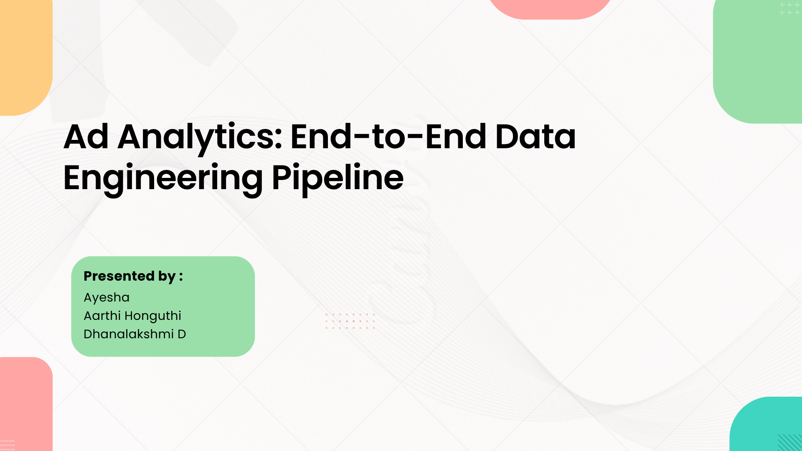 -->
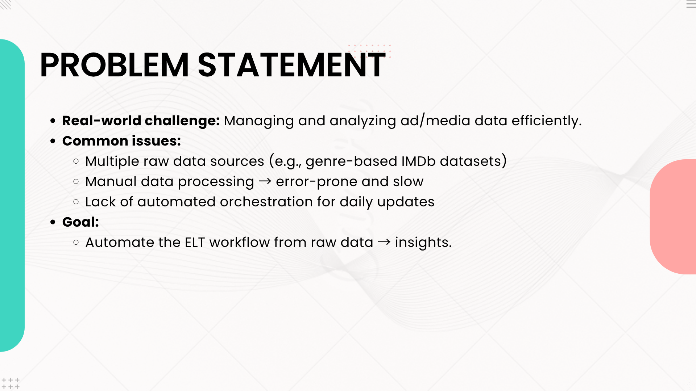
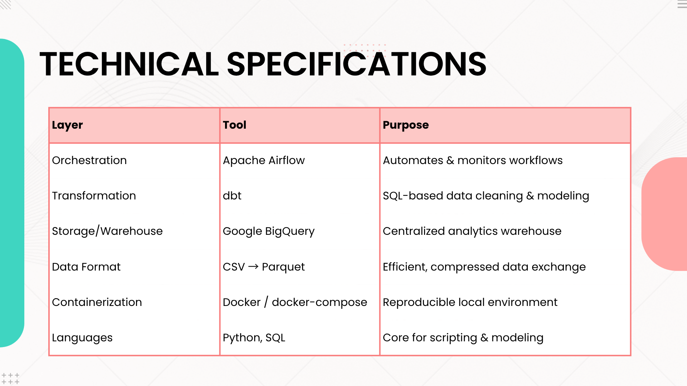
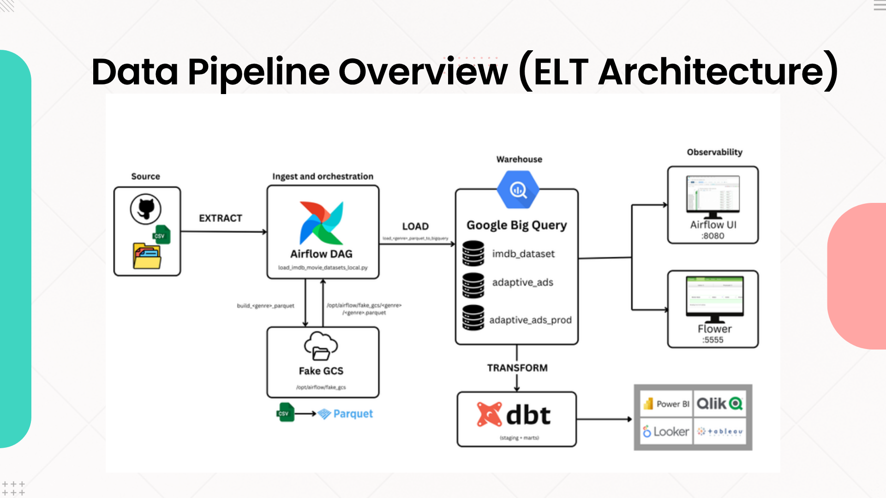
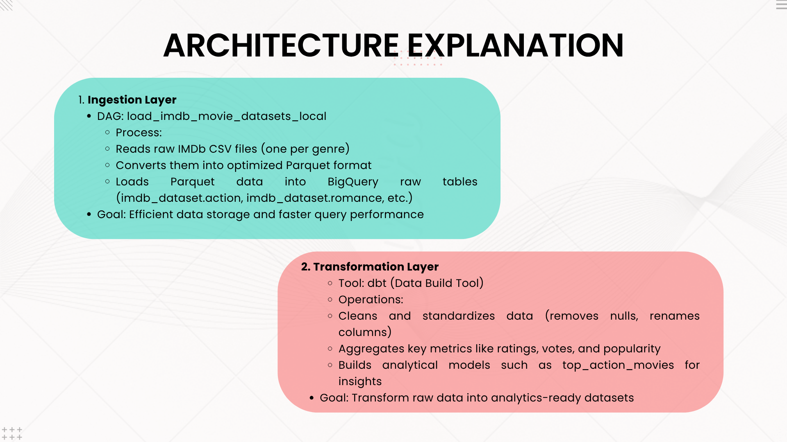
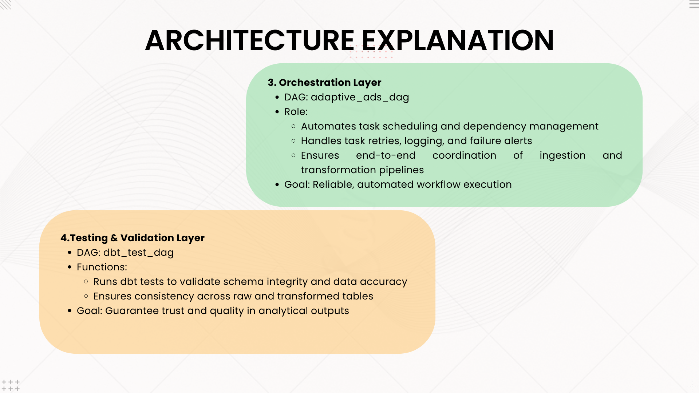
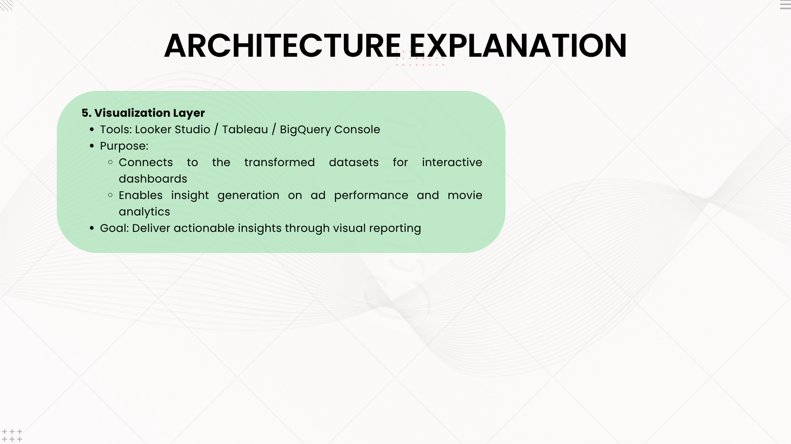


## Demo Video:
## 👥 Contributors

Watch our 2-minute project demo here:
🔗 [https://drive.google.com/file/d/1eTF47OxUEebXEzhFnJKu9dfGXvvuQDAL/view?usp=sharing](https://drive.google.com/file/d/1eTF47OxUEebXEzhFnJKu9dfGXvvuQDAL/view?usp=sharing)

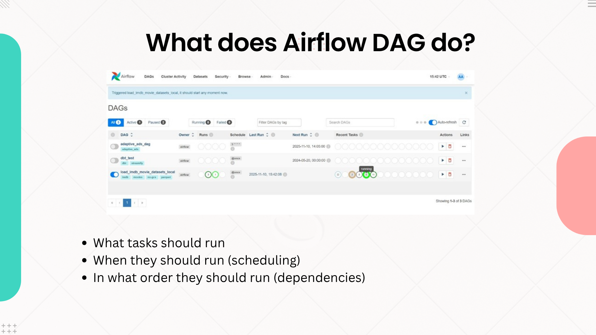
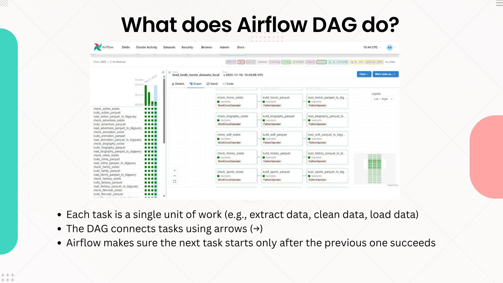
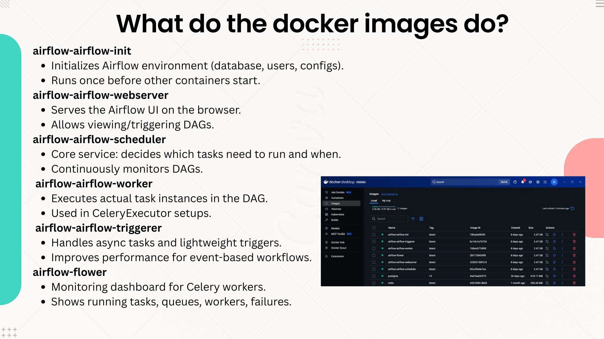
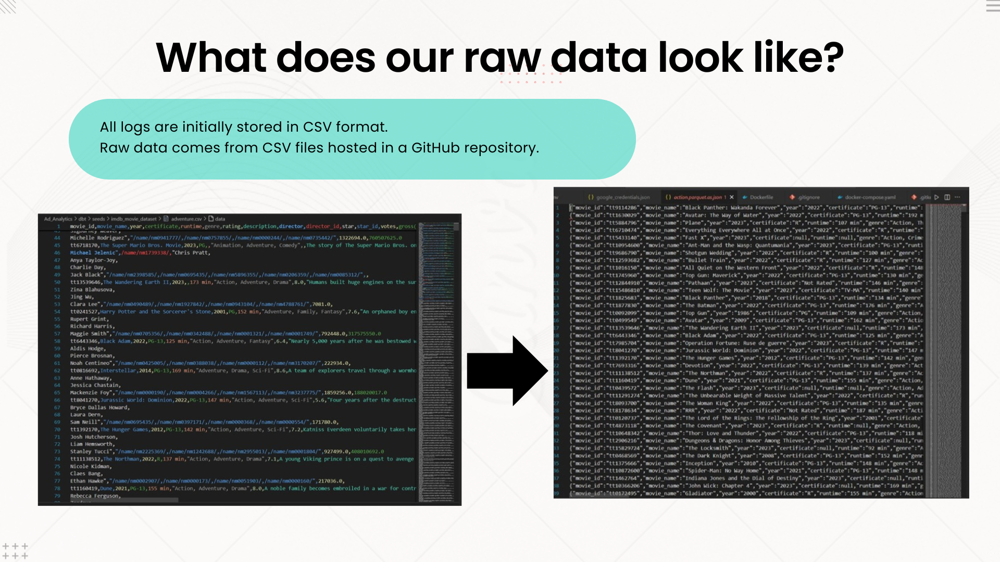
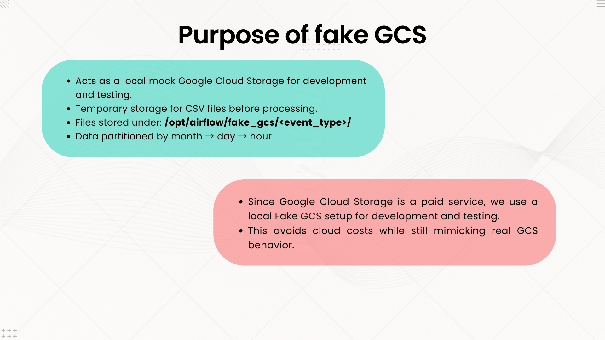
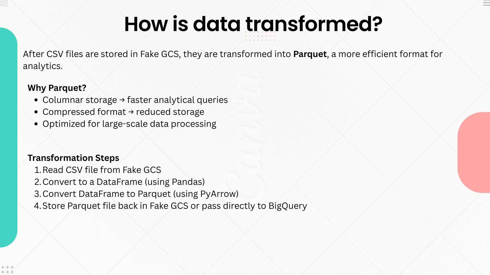
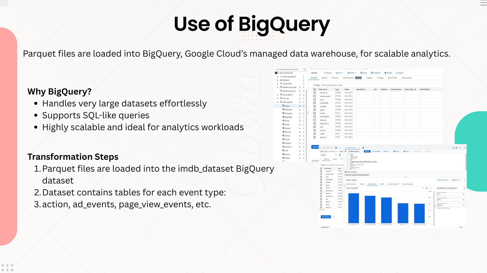
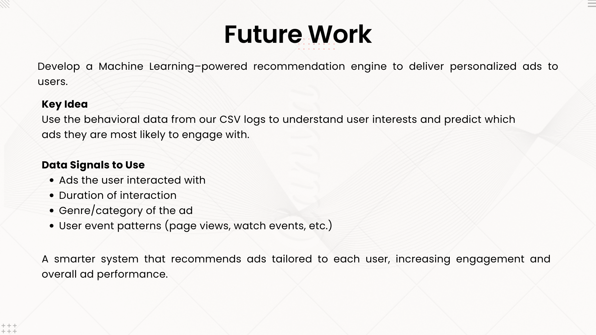
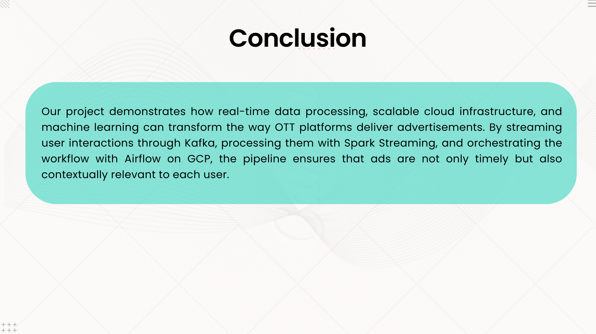
<!--  -->
- **Ayesha**
- **Aarthi Honguthi**
- **Dhanalakshmi Dhanapal**
