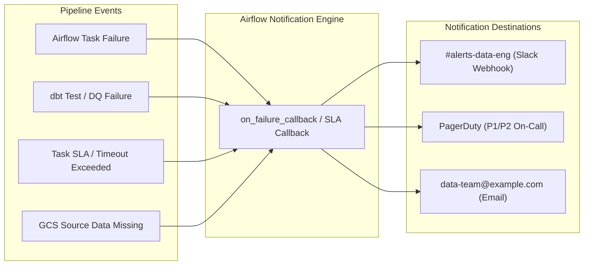

# Alerting Strategy & Incident Response Framework

This document details the monitoring, notification routing, and incident triage matrix for the **Adaptive Ads Data Engineering Platform**.

---

## 1. Alerting Architecture & Notification Channels



---

## 2. Alert Severity Matrix & Incident SLA

| Alert Name | Trigger Condition | Severity | Notification Channel | Response SLA | Recovery Action |
| :--- | :--- | :--- | :--- | :--- | :--- |
| **`PIPELINE_CRITICAL_FAIL`** | `adaptive_ads_dag` fails after all retries. | **P1 (Critical)** | PagerDuty + Slack `#alerts-data-eng` | 15 Minutes | Check BigQuery quotas / GCP IAM; verify GCS landing bucket; clear failed tasks. |
| **`DATA_QUALITY_VIOLATION`** | `dbt test` fails on primary key uniqueness or referential integrity. | **P2 (High)** | Slack `#alerts-data-eng` | 1 Hour | Inspect test failure logs; isolate malformed event batch; check SCD2 `dim_users` for duplicates. |
| **`PIPELINE_SLA_BREACH`** | Hourly ingestion and transformation exceeds 25 minutes. | **P3 (Medium)** | Slack `#alerts-data-eng` | 4 Hours | Inspect BigQuery slot utilization and concurrent queries; check worker queue latency. |
| **`SOURCE_DATA_ABSENT`** | GCS Parquet path empty for scheduled hourly partition. | **P3 (Medium)** | Slack `#alerts-data-eng` | 4 Hours | Verify upstream event collector health; check network latency; schedule manual backfill if delayed. |

---

## 3. Airflow Failure Callback Configuration

In production Cloud Composer environments, `default_args` configures the standard `on_failure_callback`:

```python
from airflow.providers.slack.operators.slack_webhook import SlackWebhookOperator

def task_failure_alert(context):
    """Callback function triggered when any Airflow task exhausts all retries."""
    task_id = context.get('task_instance').task_id
    dag_id = context.get('task_instance').dag_id
    exec_date = context.get('execution_date')
    log_url = context.get('task_instance').log_url
    exception = context.get('exception')
    
    alert_msg = f"""
    :red_circle: *Airflow Task Failure Alert*
    *DAG*: `{dag_id}`
    *Task*: `{task_id}`
    *Execution Date*: `{exec_date}`
    *Exception*: `{exception}`
    *Logs*: <{log_url}|View Task Logs>
    """
    
    # In production, dispatch alert to Slack webhook
    print(f"[ALERT] {alert_msg}")
```

---

## 4. Incident Resolution & Post-Mortem Playbook

1. **Acknowledge & Assess**: On-call engineer acknowledges alert within SLA and inspects Airflow Grid view and logs.
2. **Isolate Root Cause**:
   - Infrastructure vs. Data Quality vs. Upstream Collector.
3. **Execute Recovery**: Use playbooks documented in [`docs/OPERATIONS_RUNBOOK.md`](file:///Users/ayesha/Downloads/multi-threading-project/ad-data/docs/OPERATIONS_RUNBOOK.md).
4. **Log Incident**: Record incident root cause, resolution duration, and preventative action items.

