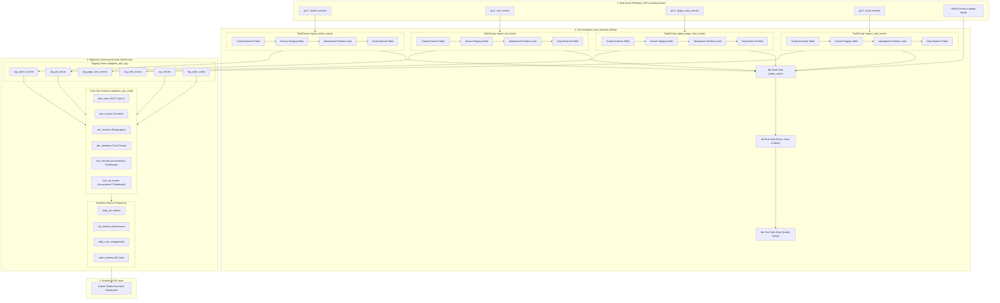

# System Architecture: Adaptive Ads Data Engineering Platform

## 1. Problem Statement & Business Context

In digital advertising and streaming media platforms, understanding ad performance, viewer engagement, and audience reach requires processing high-velocity event telemetry across multiple domains:
- **Video Playback Events** (`watch_events`): Track watch durations, content titles, and user playback sessions.
- **Advertising Impressions & Interactions** (`ad_events`): Track ad formats, exposures, and interaction completion.
- **User Navigation & Authentication** (`page_view_events`, `auth_events`): Track session health and subscriber tiers.

The **Adaptive Ads Data Engineering Platform** solves these challenges by providing an end-to-end, production-grade ELT data pipeline orchestrated with **Apache Airflow**, modeled with **dbt**, and queried on **Google BigQuery**.

---

## 2. End-to-End System Architecture

---

## 3. Storage & Data Modeling Architecture

The warehouse follows a 4-tier layer separation:
1. **Raw / Landing Zone**: Immutable hourly Parquet files stored in GCS (`gs://.../<event>/month=M/day=D/hour=H/*`).
2. **Staging Layer (`adaptive_ads_stg`)**: Lightly cleaned, casted, standardized views and partition tables populated by Airflow.
3. **Core Warehouse (`adaptive_ads_prod`)**: Kimball dimensional star schema:
   - Dimensions: `dim_users` (SCD Type 2), `dim_movies`, `dim_location`, `dim_datetime`.
   - Facts: `fact_streams`, `fact_ad_events` (incremental day-partitioned tables with multi-column clustering).
4. **Analytical Marts (`adaptive_ads_prod`)**: Aggregated, dashboard-ready summary tables and reporting views (`daily_ad_metrics`, `ad_content_performance`, `daily_user_engagement`, `wide_streams`).

---

## 4. Key Engineering Decisions & Trade-Offs

| Decision | Implemented Approach | Alternative Considered | Rationale |
| :--- | :--- | :--- | :--- |
| **Orchestration Structure** | Airflow TaskGroups in unified hourly DAG | Multiple standalone DAGs per event | Synchronizes hourly batch execution, reduces scheduling overhead, and provides clear fan-out/fan-in observability. |
| **Ingestion Idempotency** | Partition-scoped `DELETE` before `INSERT` | Append-only raw loads | Prevents row duplication on task retries and backfills without needing expensive global table deduplication. |
| **Fact Materialization** | Incremental `merge` on surrogate keys with 3-day lookback | Full-table rebuilds (`table`) | Minimizes BigQuery slot consumption while automatically accommodating late-arriving events. |
| **Partitioning & Clustering** | Day-partitioned on `ts`, clustered on high-cardinality keys | Unpartitioned tables | Enables partition pruning and colocation, accelerating query performance and reducing scan costs. |

