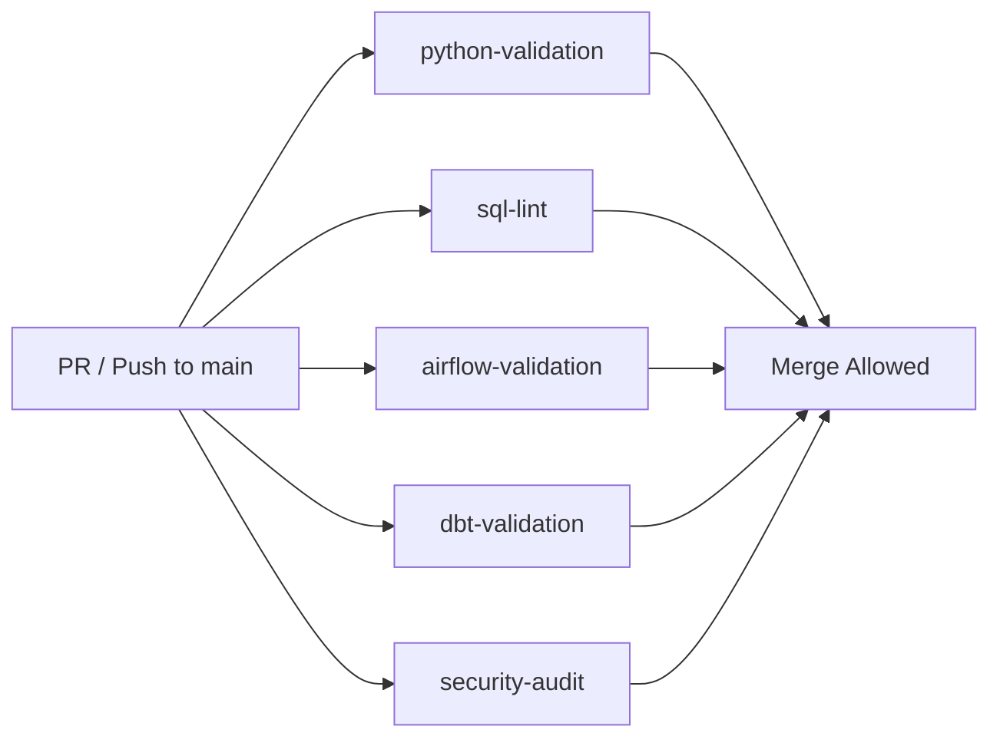

# CI/CD & Automated Validation Specification

This document details the Continuous Integration and Quality Assurance architecture for the **Adaptive Ads Data Engineering Platform**.

---

## 1. CI Workflow Overview (`.github/workflows/ci.yml`)

The CI pipeline runs on every `push` and `pull_request` to the `main` branch.



---

## 2. CI Jobs & Validation Gates

| Job Name | Purpose | Tools & Checks |
| :--- | :--- | :--- |
| **`python-validation`** | Syntax integrity & code style | Python 3.9 `py_compile` + Ruff linter (`ruff check .`). |
| **`sql-lint`** | SQL syntax & BigQuery standards | SQLFluff with BigQuery dialect on models and ingestion templates. |
| **`airflow-validation`** | DAG loading & template mapping | Validates `DagBag` parsing, unique DAG IDs, macro resolution, and template existence. |
| **`dbt-validation`** | dbt package & model graph | Resolves dbt packages and model schema dependencies. |
| **`security-audit`** | Credential leak detection | Automated scanning for uncommitted `.env`, service account JSONs, and private keys. |

---

## 3. Two-Tier Testing Strategy

### Tier 1: Pull Request / Static CI (Credentials-Free)
- Executes entirely inside the GitHub Actions runner.
- Does **not** require private production GCP credentials.
- Guarantees that no broken SQL, invalid Python, unparseable DAGs, or leaked secrets can be merged into `main`.

### Tier 2: Cloud Integration Testing (Scheduled / Gated)
- Runs in dedicated staging BigQuery environments when repository secrets are provisioned (`GCP_SA_KEY`).
- Executes `dbt run --target dev` and `dbt test --target dev` against temporary test datasets.

---

## 4. Local Developer Validation

Before committing code, developers can execute the complete static validation suite locally with one command:
```bash
./scripts/validate.sh
```

This ensures fast feedback before pushing pull requests.

