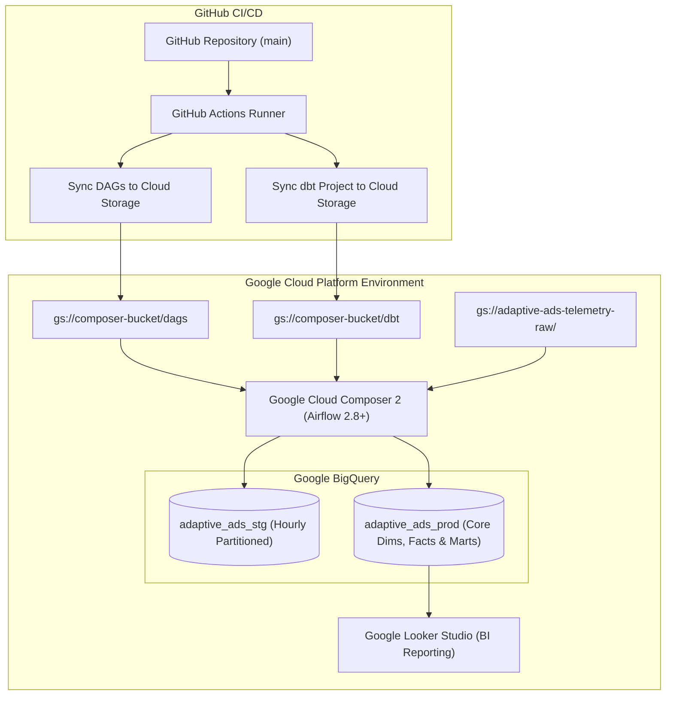

# Production Deployment Guide: Google Cloud Composer & BigQuery

This guide outlines the production deployment architecture for the **Adaptive Ads Data Engineering Platform** on Google Cloud Platform (GCP).

---

## 1. Production Architecture Overview



---

## 2. Prerequisites & GCP Resources

| Resource | Recommended Specification | Purpose |
| :--- | :--- | :--- |
| **Google Cloud Composer 2** | Small / Medium Cluster (Airflow 2.8+) | Managed Airflow orchestration. |
| **Google Cloud Storage (GCS)** | Standard Multi-Regional Bucket | Ingestion landing zone for telemetry Parquet files. |
| **Google BigQuery** | On-demand / Slot Reservations | Data warehouse storage and compute. |
| **IAM Service Account** | Least-privilege role bindings | Automation credentials for Airflow and dbt. |

---

## 3. IAM Service Account & Permissions

Create a dedicated service account `sa-adaptive-ads-pipeline@<PROJECT_ID>.iam.gserviceaccount.com` with the following IAM roles:

```bash
# BigQuery Permissions
gcloud projects add-iam-policy-binding ${GCP_PROJECT_ID} \
    --member="serviceAccount:sa-adaptive-ads-pipeline@${GCP_PROJECT_ID}.iam.gserviceaccount.com" \
    --role="roles/bigquery.admin"

# Cloud Storage Permissions
gcloud projects add-iam-policy-binding ${GCP_PROJECT_ID} \
    --member="serviceAccount:sa-adaptive-ads-pipeline@${GCP_PROJECT_ID}.iam.gserviceaccount.com" \
    --role="roles/storage.objectAdmin"
```

---

## 4. Environment Variables Configuration

Set the following Airflow Environment Variables in Cloud Composer:

```bash
GCP_PROJECT_ID=your-production-gcp-project-id
BIGQUERY_DATASET=adaptive_ads_stg
GCP_GCS_BUCKET=adaptive-ads-telemetry-raw
GOOGLE_APPLICATION_CREDENTIALS=/etc/credentials/service-account.json
```

---

## 5. Deployment Step-by-Step

### Step 1: Create BigQuery Datasets
```bash
bq --location=asia-south1 mk --dataset ${GCP_PROJECT_ID}:adaptive_ads_stg
bq --location=asia-south1 mk --dataset ${GCP_PROJECT_ID}:adaptive_ads_prod
```

### Step 2: Sync DAGs and dbt Project to Cloud Composer Bucket
```bash
COMPOSER_BUCKET="us-central1-adaptive-ads-c1-bucket"

# Sync Airflow DAGs and templates
gsutil -m rsync -r -d ./airflow/dags gs://${COMPOSER_BUCKET}/dags

# Sync dbt models, seeds, and macros
gsutil -m rsync -r -d ./dbt gs://${COMPOSER_BUCKET}/dbt
```

### Step 3: Trigger Initial Seed & Model Build
Once Cloud Composer synchronizes the DAGs:
1. Unpause `adaptive_ads_dag`.
2. Execute an initial run to seed `state_codes` and build `dim_users`, `dim_movies`, `fact_streams`, `fact_ad_events`, and analytical marts.

