# Phase 2: Architecture & Pipeline Design

## 1. Overview & Baseline

Following the correctness stabilization in Phase 1, Phase 2 establishes a modular, decoupled, idempotent, and extensible architecture for the **Adaptive Ads / Ad Analytics Data Engineering Platform**.

The platform is designed around a multi-layer ELT paradigm:
```
Raw Telemetry (GCS)
       ↓
Airflow Ingestion (Parallel TaskGroups)
       ↓
BigQuery Staging Layer (Partition-Scoped Idempotent Loads)
       ↓
dbt Dimensional Modeling (SCD2 Dims & Partitioned Facts)
       ↓
Analytics Marts & Reporting Layer (Views & BI Data Models)
```

---

## 2. Problems Identified in Legacy Pipeline

1. **Monolithic Task Chaining & Stream Coupling**:
   - Ingestion tasks were sequentially linked across all event types, causing unrelated event streams (e.g., `auth_events` or `page_view_events`) to block or be blocked by other streams.
2. **Duplicated Ingestion Logic & Scattered Configuration**:
   - Event paths, schemas, table mappings, and task sequences were repeatedly defined across multiple scripts without a unified configuration registry. Adding new event streams required modifying DAG definitions and repeating boilerplate task wiring.
3. **Lack of Ingestion Idempotency on Retries**:
   - The ingestion SQL executed plain `INSERT` operations into staging tables. If an hourly DAG run was retried or failed midway, duplicate records were appended to the target BigQuery table.
4. **Weak Reliability & Error Handling**:
   - Tasks lacked standardized retry policies (`retries`, `retry_delay`), execution timeouts, and used raw `print()` statements instead of Python standard logging.
5. **Unclear Dataset & Layer Boundaries**:
   - Boundaries between raw landing external tables, staging storage, core dimensional models, and analytics views were informal and undocumented.

---

## 3. New Architecture

```mermaid
flowchart TD
    subgraph Raw_Sources["Raw Event Sources (GCS / Landing)"]
        W_SRC["watch_events (Parquet)"]
        A_SRC["ad_events (Parquet)"]
        P_SRC["page_view_events (Parquet)"]
        AU_SRC["auth_events (Parquet)"]
        IMDB_SRC["IMDb Seeds / CSVs"]
    end

    subgraph Airflow_Orchestration["Airflow Orchestration (adaptive_ads_dag)"]
        subgraph TG_Watch["TaskGroup: ingest_watch_events"]
            W_EXT["Create External Table"] --> W_STG_TBL["Ensure Staging Table"] --> W_LOAD["Idempotent Partition Load"] --> W_CLN["Cleanup External Table"]
        end

        subgraph TG_Ad["TaskGroup: ingest_ad_events"]
            A_EXT["Create External Table"] --> A_STG_TBL["Ensure Staging Table"] --> A_LOAD["Idempotent Partition Load"] --> A_CLN["Cleanup External Table"]
        end

        subgraph TG_PageView["TaskGroup: ingest_page_view_events"]
            P_EXT["Create External Table"] --> P_STG_TBL["Ensure Staging Table"] --> P_LOAD["Idempotent Partition Load"] --> P_CLN["Cleanup External Table"]
        end

        subgraph TG_Auth["TaskGroup: ingest_auth_events"]
            AU_EXT["Create External Table"] --> AU_STG_TBL["Ensure Staging Table"] --> AU_LOAD["Idempotent Partition Load"] --> AU_CLN["Cleanup External Table"]
        end
    end

    subgraph BQ_Staging["BigQuery Staging Layer (adaptive_ads_stg)"]
        STG_W["watch_events (Hour Partitioned)"]
        STG_A["ad_events (Hour Partitioned)"]
        STG_P["page_view_events (Hour Partitioned)"]
        STG_AU["auth_events (Hour Partitioned)"]
        STG_SEEDS["state_codes & movies"]
    end

    subgraph DBT_Transformations["dbt Transformations Layer"]
        DBT_SEED["dbt seed (state_codes)"]
        DBT_RUN["dbt run (Dimensions & Facts)"]
    end

    subgraph Core_Layer["Core Data Warehouse Layer (adaptive_ads_prod)"]
        DIM_U["dim_users (SCD Type 2)"]
        DIM_M["dim_movies"]
        DIM_L["dim_location"]
        DIM_D["dim_datetime"]
        FACT_S["fact_streams (Hour Partitioned)"]
    end

    subgraph Analytics_Layer["Analytics & Reporting Layer"]
        WIDE_S["wide_streams (Reporting View)"]
        TOP_M["top_action_movies (Content Mart)"]
    end

    %% Ingestion Links
    W_SRC --> TG_Watch
    A_SRC --> TG_Ad
    P_SRC --> TG_PageView
    AU_SRC --> TG_Auth
    IMDB_SRC --> DBT_SEED

    TG_Watch --> STG_W
    TG_Ad --> STG_A
    TG_PageView --> STG_P
    TG_Auth --> STG_AU

    %% Synchronization to dbt
    TG_Watch --> DBT_SEED
    TG_Ad --> DBT_SEED
    TG_PageView --> DBT_SEED
    TG_Auth --> DBT_SEED

    DBT_SEED --> DBT_RUN

    STG_W & STG_A & STG_P & STG_AU & STG_SEEDS --> DBT_RUN

    DBT_RUN --> DIM_U
    DBT_RUN --> DIM_M
    DBT_RUN --> DIM_L
    DBT_RUN --> DIM_D
    DBT_RUN --> FACT_S

    DIM_U & DIM_M & DIM_L & DIM_D & FACT_S --> WIDE_S
    DIM_M --> TOP_M
```



---

## 4. Ingestion Idempotency Strategy

To prevent duplicate data during retries, manual backfills, or partial task failures, ingestion uses a **partition-scoped replacement** pattern:

### Execution Lifecycle per Hourly Interval (`logical_date`):
1. **Transient Landing Table**: Airflow creates a deterministic external table (`<staging_table>_<MMDDHH>`) pointing to the specific hourly GCS Parquet path (`.../month=M/day=D/hour=H/*`).
2. **Atomic Partition Purge**: Before inserting new records, the SQL script purges existing records matching the execution timestamp partition:
   ```sql
   DELETE FROM adaptive_ads_stg.<table_name>
   WHERE ts >= TIMESTAMP('<logical_date_hour_start>')
     AND ts < TIMESTAMP_ADD(TIMESTAMP('<logical_date_hour_start>'), INTERVAL 1 HOUR);
   ```
3. **Coalesced Insert**: Data is selected, standardized with fallback defaults, and inserted into the partitioned staging table.
4. **Transient Teardown**: The external table is dropped (`ignore_if_missing=True`).

### Retry Scenarios:
- **First Run**: Creates external table, deletes 0 matching partition rows (none exist), inserts hourly records, cleans up external table.
- **Midway Failure**: If the task fails during insertion, the external table remains until the next attempt or is overwritten. On retry, the pre-delete purges any partially inserted rows before reloading.
- **Airflow Rerun / Backfill**: Re-running the execution date safely replaces that hour's partition data without affecting adjacent partitions or creating duplicates.

---

## 5. Failure Handling & Stream Decoupling

- **Independent Ingestion Execution**: Ingestion branches run in parallel `TaskGroup` containers (`ingest_watch_events`, `ingest_ad_events`, `ingest_page_view_events`, `ingest_auth_events`).
- **Failure Isolation**: A network or format issue in `ad_events` will not halt or fail the ingestion of `watch_events`.
- **Downstream Safety Gate**: dbt model builds are gated behind all parallel ingestion task groups completing successfully (`ingestion_groups >> dbt_initiate >> dbt_run`), ensuring that data transformations never run on incomplete or broken staging batches.

---

## 6. Centralized Event Configuration (`event_config.py`)

All event ingestion parameters are registered in `airflow/dags/event_config.py`:
- **Event Metadata**: Name, description, GCS path template, source format.
- **Target Schema & Table**: Schema definition, staging table name.
- **Transformation SQL & Partitioning**: SQL template path, partition key (`ts`), partition granularity (`HOUR`).

### Adding a New Event Type:
To add a new event stream (e.g. `click_events`), an engineer only needs to:
1. Add the schema definition to `schema.py`.
2. Add the event entry to `EVENT_CONFIG` in `event_config.py`.
3. Add the ingestion SQL template in `airflow/dags/sql/click_events.sql`.

No modifications to DAG task orchestration or wiring code are required.

---

## 7. Architectural Decisions: TaskGroups vs. Multi-DAG

We evaluated two architectural patterns for Airflow:

| Architecture | Pros | Cons | Verdict |
| :--- | :--- | :--- | :--- |
| **Option A: Separate DAG per Event** | Isolated DAG schedules; independent pause/unpause. | Complex cross-DAG synchronization (`ExternalTaskSensor`), duplicate schedules, fragmented monitoring across 5+ DAGs. | Rejected for current scope |
| **Option B: TaskGroups in Unified Hourly DAG** | Synchronized hourly batch execution; parallel decoupled execution; collapsible visual UI; simple fan-out/fan-in dependencies. | All streams must complete before downstream dbt run begins. | **Selected & Implemented** |

**Rationale**: Because all four event telemetry streams share the same batch frequency (hourly) and feed directly into unified dimensional facts (`fact_streams`), TaskGroups provide the ideal balance of isolation, clean observability, and straightforward dependency management.

---

## 8. Logical vs. Physical Data Layers

| Layer | Physical / Logical | Storage Engine | Purpose |
| :--- | :--- | :--- | :--- |
| **Raw / Landing** | Physical + Transient | GCS Parquet + BQ External Tables | Unaltered immutable event files partitioned by month/day/hour. |
| **Staging** | Physical (Dataset: `adaptive_ads_stg`) | BigQuery Partitioned Tables | Standardized, null-coalesced, typed hourly tables (`watch_events`, `ad_events`, etc.). |
| **Core Warehouse** | Physical (Dataset: `adaptive_ads_prod`) | BigQuery Tables (managed by dbt) | Kimball star schema: SCD Type 2 `dim_users`, `dim_movies`, `dim_location`, `dim_datetime`, and `fact_streams`. |
| **Analytics / Marts** | Logical & Physical (managed by dbt) | BigQuery Views / Summary Tables | `wide_streams` view joining facts with all dimensions for Looker/BI dashboards. |

---

## 9. Future Architecture (Phase 3+ Roadmap)

1. **Target dbt Directory Modularization**:
   - Transition `dbt/models/` into explicit subfolders: `staging/` (views over raw staging), `intermediate/` (event window aggregates), `core/` (star schema dims & facts), and `marts/` (business analytics).
2. **dbt Dependency & Package Upgrade**:
   - Upgrade `dbt_utils` to >= 1.x (`generate_surrogate_key`) and newer dbt core.
3. **CI/CD Quality Gates**:
   - Automated pull-request validation using GitHub Actions, SQLFluff linting, and BigQuery sandbox testing.
4. **BI Layer**:
   - Looker Studio semantic modeling on `wide_streams`.

