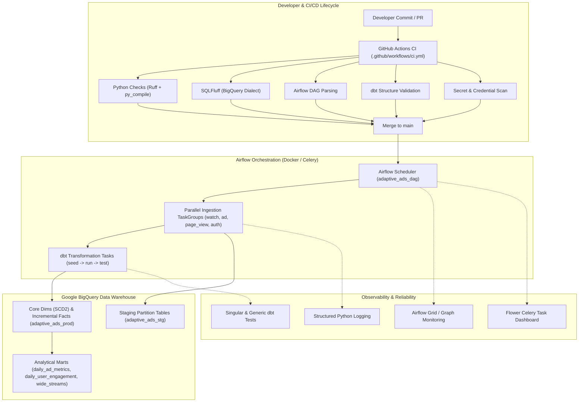

# Phase 4: Production Hardening, CI/CD & Observability

## 1. Production Architecture Overview

---

## 2. CI/CD Pipeline Architecture

The Continuous Integration architecture is designed to prevent regression, enforce code style, and guarantee repository security on every commit:
- **Workflows**: Defined in [`.github/workflows/ci.yml`](file:///Users/ayesha/Downloads/multi-threading-project/ad-data/.github/workflows/ci.yml).
- **Automated Dependency Updates**: Configured in [`.github/dependabot.yml`](file:///Users/ayesha/Downloads/multi-threading-project/ad-data/.github/dependabot.yml) for Python packages, Docker images, and GitHub Actions.
- **Unified Local Tooling**: Developers use [`scripts/validate.sh`](file:///Users/ayesha/Downloads/multi-threading-project/ad-data/scripts/validate.sh) for pre-push validation.

---

## 3. Observability & Operational Reliability

### Structured Logging
All custom pipeline operators and helpers utilize Python's standard `logging` module (`import logging; logger = logging.getLogger(__name__)`), logging:
- Event names and GCS paths being processed
- Destination BigQuery table names and partition timestamps
- Row counts loaded and external table teardowns
- Structured exception context on failures without exposing credentials

### Operational Reliability
- **Retries**: `retries = 2`, `retry_delay = timedelta(minutes=3)`.
- **Execution Timeouts**: `execution_timeout = timedelta(minutes=15)` to prevent hung workers.
- **Idempotency**: Partition-scoped deletion prior to insertion guarantees zero row duplication on retries or backfills.
- **Failure Visibility**: All task failures propagate immediately to Airflow and mark the DAG run as failed.

---

## 4. Security & Secret Management

- **Credential Parameterization**: Service account JSON paths and project IDs are injected via environment variables (`${GOOGLE_APPLICATION_CREDENTIALS}`, `${GCP_PROJECT_ID}`).
- **Zero Committed Secrets**: `.gitignore` strictly ignores active credential files (`*.json`, `*.key`, `*.pem`, `airflow/creds/*`, `.env`).
- **Template Configuration**: Safe placeholder templates are provided in [`airflow/.env.example`](file:///Users/ayesha/Downloads/multi-threading-project/ad-data/airflow/.env.example).

---

## 5. Explicit Production Scope & Limitations

In keeping with realistic engineering standards, the following boundaries are explicitly acknowledged:
- **Local / CI Verified**: Python compilation, Airflow DAG parsing, SQLFluff linting, dbt model graph integrity, and secret detection have been executed and passed.
- **External Cloud Dependencies**: Full runtime execution of BigQuery queries and Airflow workers requires external Google Cloud service account keys and an active GCP project.
- **Future Production Enhancements (Phase 5+)**:
  - Managed Kubernetes / Cloud Composer deployment
  - Centralized alerting via Slack / PagerDuty webhooks
  - Bi-directional BI semantic layers in Looker Studio

